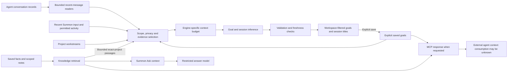

# Desktop companion

First implemented 2026-09-15; memory, routines, dedicated wake detection and local interpretation added 2026-09-16. The selected Liquid model was added on 2026-09-16. Listening controls moved to the menu bar on 2026-09-21. Work in flight was added on 2026-09-17, then Agent sessions, the menu-bar count and Where this stands later the same day. This document describes the running application, whatever its version number; the version itself lives in `package.json`. The earlier SDK, session, and generated-surface proposals in [architecture.md](architecture.md) and [build-plan.md](build-plan.md) are future work.

## How it works

Electron hosts a local metadata service and a React workbench. A small Swift helper reports active applications and optional focused-window context. File watchers and Automatic Filing receipts update a persistent ledger. Both the interface and the MCP bridge read this same service.

Routine commands use a deterministic command router. Commands stay deterministic. Goal and session reasoning periodically summarizes changed evidence; it does not interpret or execute each app switch or file event. The service is independent of which AI client you use, but is currently hosted by the running Summon app rather than a separate launch daemon.

| Component | Responsibility |
|---|---|
| `src/core/companion.mjs` | File identity, scoped discovery, filing receipts, workspace associations, persistence, retention |
| `src/main/desktop-voice.mjs` | Synchronized voice state, lifecycle and microphone stop behavior |
| `src/main/main.mjs` | Electron lifecycle, validated IPC, native helper, menu bar, shortcuts, permissions |
| `src/main/commands.mjs`, `command-session.mjs` | Direct commands, successful-command receipts, validated routines |
| `src/core/knowledge.mjs` | Explicit facts, scoped project-note retrieval, durable routines |
| `src/main/local-model.mjs` | Optional local Ollama interpretation into reviewed commands |
| `src/main/wake.mjs`, `native/wake/` | Persistent offline keyword detector and setup |
| `src/main/benchmark.mjs`, `claude-models.mjs`, `model-selection.mjs` | Public/keyed rankings, local cache, CLI model catalog and Claude launch selection |
| `src/main/engines.mjs` | Explicit, restricted CLI answer requests |
| `src/main/usage-claude.mjs`, `src/main/usage-codex.mjs`, `src/core/usage.mjs`, `src/main/engine-choice.mjs` | Usage meter: one bounded read per CLI of its own subscription windows, the cached readings and five-minute loop, and the fixed rule that picks an engine from them |
| `src/core/git-scan.mjs`, `src/core/work-in-flight.mjs` | Work in flight: read-only git scanner; service, cache and grouping jobs |
| `src/core/workstreams.mjs`, `src/main/workstream-engine.mjs` | Work in flight privacy filter, grouping prompt and answer checks; restricted Codex/Claude grouping call |
| `scripts/work-in-flight.mjs`, `src/renderer/WorkInFlightPanel.tsx` | `npm run flight` terminal view and the Work in flight panel |
| `src/core/standing.mjs` | Where this stands: the watermark you set by looking, the ledger of past scans, and the plain deltas behind the paragraph and the “Not moving” rail |
| `src/core/agent-sessions.mjs` | Agent sessions: combined view, groups and words, folder matching, settings, open targets |
| `src/core/sessions/` | Agent sessions: read-only readers for Claude, Codex, Cursor and Hermes, plus the SQLite copy, LevelDB and process-list helpers |
| `scripts/agent-sessions.mjs`, `src/renderer/SessionsPanel.tsx` | `npm run sessions` terminal view and the Agent sessions panel |
| `src/core/visual-repository.mjs`, `visual-goals.mjs`, `visual-workspace.mjs`, `src/renderer/VisualWorkspacePanel.tsx` | Visual workspace: bounded local git/import graphs, explicit goal storage, shared selection, kitchen and hook event history |
| `src/main/transcription.mjs`, `native/transcription-worker.mm` | In-memory PCM conversion and a private persistent Whisper worker |
| `src/main/rpc.mjs`, `scripts/mcp-server.mjs` | Local socket service and stdio MCP adapter |
| `src/renderer/` | Workbench, preferences, local recording, wake-gated voice and memory controls |
| `native/Context.swift` | macOS activity and download-source metadata |

## Workspace and appearance

The workbench opens on **Overview**: the command field, unfinished repository work, attention-first agent sessions, and each CLI's reported subscription windows. The navigation rail keeps **Files**, **Agents**, **Work**, **Memory**, **Visuals**, **Teach** and **Settings** within reach. Commands and voice results reveal the Files view, where the existing answer actions, file receipts and activity remain available. **New task** opens a deliberate launcher: choose a workspace and Claude or Codex, then start the installed CLI in Terminal with its existing sign-in and session hooks. Enter the task in Terminal once it opens.

Summon follows macOS Appearance automatically, including scheduled Auto changes, and switches live without a restart. Light mode uses a light gray desk and rounded white panels; dark mode uses charcoal surfaces and light text. Both retain generous spacing, Avenir Next with local system fallbacks, and a neutral accent by default. Use **Settings → Appearance** to choose Black, Forest, Blue, Plum, Terracotta, or a custom hex color. The choice is saved in Summon's local settings and survives restart. Text, buttons, hover colors and usage bars derive readable variants for the current appearance while preserving the saved accent; status colors keep their separate meaning. Native window backgrounds, dialogs, graph controls and the kitchen environment follow the same system preference. Appearance settings make no network requests.

Overview cards use the existing local services, refreshing while the window is visible. They never start model grouping or mark work as reviewed. Counts and states come from actual records; unfinished work has no invented completion percentage. Unknown or stale usage remains labeled, and the full detail panels remain available through **View all** or **Details**. The browser-only preview continues to use clearly labeled sample data.

The shell and tokens live in `src/renderer/main.tsx`, `styles.css` and `workspace.css`; bounded overview cards in `WorkspaceOverview.tsx`; accent validation and contrast roles in `src/core/appearance.mjs` and `src/renderer/appearance.ts`; the picker in `AccentPicker.tsx`.

## What it observes

**Files.** The service watches direct files in Downloads and Desktop, configured Automatic Filing destination folders, and known subdirectories identified by records or filing receipts. It records names, sizes, paths, filesystem identity, available filesystem dates, source URL metadata, workspace association, and event times. It does not recursively crawl project repositories or open workbook/document contents. [Work in flight](#work-in-flight) is a separate, on-demand, read-only git reader. [Agent sessions](#agent-sessions) reads session details and bounded recent conversation excerpts for goal and session reasoning from Claude, Codex, Cursor and Hermes, when a view, the menu-bar count, goal reasoning, the terminal command, or a connected agent requests a read. Ordinary terminal and MCP responses omit conversation excerpts.

Automatic Filing is optional. When installed, Summon reads:

```text
~/Library/Application Support/Automatic Filing/config.json
~/Library/Application Support/Automatic Filing/state/moves.jsonl
```

These are read-only inputs. Move and undo receipts are imported into Summon's own ledger. Summon does not change the filer configuration or move, rename, delete, or undo files itself. Assigning a file to a workspace changes its context record only.

The first scan establishes a baseline: files already present are not treated as if they were downloaded for whichever workspace you just selected. New arrivals can inherit your selected workspace. Path and filename matches are labeled as inferences, and a manual correction takes precedence. File recency uses real creation/modification and filing dates where available; periodic scans do not make an old file appear newly downloaded.

**Apps.** App activity records the application name and bundle identifier on app switches. Window context is separately enabled and may add the focused window title and local document path exposed by the app. It reads no full accessibility tree or document text. Excluded apps clear the current context without saving their identities. Defaults exclude common password managers; Preferences accepts additional app names or bundle identifiers.

**Download source.** The native helper reads the file's `kMDItemWhereFroms` metadata when present. It prefers an available referring page and removes URL credentials, query strings, and fragments. It does not read browser history or install a browser extension. Source metadata is not guaranteed; a download without it appears with “Source not recorded.” Paths and source URLs may still contain sensitive information.

The native helper's exact event format and sampling behavior are documented in [native/README.md](../native/README.md).

## Finding files and understanding limits

Try “find my Excel files,” “where did my workbook go,” or “show my downloads.” The ledger provides **Open file**, **Show in Finder**, and a workspace correction menu. “Open my calendar” opens Calendar; an HTTPS calendar destination in Preferences changes that shortcut.

Workspace selection is explicit intent. An observed application or filename is evidence, not proof of the task you are doing. Selecting a workspace does not make Summon index every file inside it.

A rename or move can be followed when the same filesystem identity is found within the known watched directories, or when a valid filing receipt records the change. Moving a file into an unobserved folder, a new nested directory without a known receipt, another volume, or a location outside the configured scope can leave a **Not found** record with the last known path. Copies have new identities. This is a bounded activity ledger, not a replacement for Spotlight or a universal filesystem index.

If macOS denies access to a folder, existing records are labeled **Access needed**, and their last known locations are retained. Use **File access settings** to review Summon under macOS **Privacy & Security → Files and Folders**. A later successful scan restores the current status. Folder-event failures fall back to metadata polling only for folders that can still be read.

Open and reveal requests resolve a known record and validate its current file identity before acting. A stale record does not authorize opening a different file that later appears at the same path. Hidden files, temporary downloads, and symlink paths are excluded from discovery.

Closing the window hides it; observation continues while Summon remains in the menu bar. The pause control stops collection without removing existing records. Quitting stops the service and microphone. Automatic startup at login is not configured by this build.

## Permissions and local voice

The controls are separate:

| Capability | Required access |
|---|---|
| Basic active-app tracking | The native helper; no Accessibility permission required |
| Downloads/Desktop file records | macOS file access to those locations; the OS may show Files and Folders prompts |
| Focused window title/document path | Explicit Window context setting plus macOS Accessibility permission |
| Voice commands | Explicit recording/listening action, microphone permission, `whisper-cli`, `ffmpeg`, and a local model |
| Fn shortcut | macOS Input Monitoring for the passive Fn helper; it starts only when the helper is installed |
| Local screen reading for desktop tasks | Explicit session opt-in, macOS 14 or newer, and Screen Recording permission requested only with **Allow screen reading** |
| Usage meter | The installed `claude` and `codex` CLIs and their own sign-in: two bounded, tool-less invocations, each read-only and without a turn; no token, config or keychain entry is read |

Screen Recording is optional and requested only from **Teach a task → Mac apps → Allow screen reading**. Opening the panel or checking **Read screen text locally** does not prompt or capture. Input Monitoring supports the Fn helper and explicitly armed teaching interactions, never a raw typed-key log. Enabling Accessibility does not start voice, and granting microphone permission does not turn on listening at startup. Development executables and the packaged app can have separate macOS permission identities.

Voice is English-first and uses the installed `whisper-cli` and a selected `.bin` model. Choose the model in Preferences. The application recognizes the conventional `~/.cache/whisper-cpp/models/ggml-small.en.bin` location if that file already exists; it does not download models automatically. Install the CLI dependencies separately, then restart Summon so the health check sees them.

The **menu-bar star** lights green while the microphone is active and returns to monochrome when it is off. Choose **Start hands-free listening** from its menu to listen for “Summon”, or **Stop listening** to stop. These controls remain available while the workbench is hidden. The workbench shows detailed voice status, including starting, listening, transcribing, stopping, off, and error states. Listening stays off after launch, sleep, or screen lock.

Use the workbench microphone button for a single command, or **⌘⇧Space** to toggle recording. A plain **Fn** tap does the same once macOS **Privacy & Security → Input Monitoring → Summon** is allowed; Fn combinations, held keys and taps during other input are ignored, and set **Keyboard → Press fn/🌐 key to → Do Nothing** so macOS does not also open emoji or Dictation. The helper is a passive event tap: it distinguishes a bare tap from a chord and never decodes, stores or sends typed text; only a tap signal and a status reach Summon. It judges "another key is held" from the key-downs it has itself observed since it started, not from macOS's combined key state: on this Mac that state reported keycode 0 as held forever, which made every tap look like a chord (found 2026-09-19). If the grant is missing, Summon asks macOS once, shows the shortcut's state under **Preferences → Voice** with a link to Input Monitoring, and re-checks every ten seconds (and when the window is focused, or after wake or unlock) so a grant made in System Settings takes effect without a relaunch. The packaged bundle is signed with a designated requirement made of its bundle identifier rather than its build hash (`scripts/after-sign.mjs`), so a rebuild keeps an existing Input Monitoring grant. A grant made to a bundle built before this change is keyed to the old hash and has to be made once more, in this order: install the newly packaged bundle at `~/Applications/Summon.app` first (a reset done before the install would key the fresh grant to the old hash again), then reset only Summon's grant with `tccutil reset ListenEvent com.summon.companion`, then use **Input Monitoring → +** to add the installed `~/Applications/Summon.app`; Summon picks the grant up within ten seconds. Keep no other copy of the bundle under `~/Applications`, hidden or not: macOS resolves the grant's label and its Quit & Reopen by bundle identifier, and a leftover backup with the same identifier can be the one it picks (seen 2026-09-19). Rollback copies belong in the Trash or the `release/` folder. Silence ends a captured phrase. **Listen for “Summon”** enables the dedicated local sherpa-onnx keyword detector for this session. Voice activity detection sends short in-memory speech segments to a persistent keyword-only worker. Ordinary speech does not reach Whisper. A detected wake phrase is then transcribed locally; saying only “Summon” opens an eight-second window for the following command. A detector/transcription disagreement is discarded.

The small English Zipformer model has about 6.3 MB of selected inference weights. Install its pinned Python runtime and verified official archive deliberately:

```sh
python3 "native/wake/setup.py"
```

The script stores the runtime and model under the app data directory, outside the bundle. See [wake setup, source and license](../native/wake/README.md). Restart Summon after setup. The file ledger and single-command microphone mode work without the dedicated wake runtime.

Hands-free keeps the microphone on. It can miss speech or trigger incorrectly; synthetic checks do not establish accuracy in your room. Wake checks and accepted/explicit command transcription keep audio in memory. The desktop control, command bar and menu bar show listening state; the microphone starts off on every launch. Wake-model loading at startup does not open the microphone.

Starting voice also prepares a private Whisper worker through inherited stdin/stdout pipes. The selected speech model stays loaded for the listening session, then is released about 60 seconds after listening stops and outstanding work settles. An idle app does not preload Whisper. Renderer PCM WAV is validated and resampled in memory, without `ffmpeg` or audio files. The worker uses bounded command decoding, with no automatic cloud request. Recognized words appear in the command bar as soon as transcription finishes, before a command's lookup returns.

Capture ends after roughly 0.8 seconds of quiet, with a bounded threshold that adapts to recent voice level and background noise. The control distinguishes hearing speech, waiting for a pause, and transcribing. This remains an amplitude-based detector with an 18-second phrase cap; natural long pauses can still split a request. Speech decoding and OS action support are separate: dismissing arbitrary popups is not a current command handler.

## Memory and reusable routines

**Memory & routines** gives both clients the same explicit saved facts and searchable notes. Save a short fact with an optional workspace. Facts are labeled with who saved them and persist until you forget them; activity retention does not erase explicit memory. No background agent infers personal facts or promotes its own conclusions into memory.

A workspace named **Second Brain** enables a deliberately scoped note index: `Home.md` and `Projects/**/*Hub.md`. It does not index Profile, Areas, imported conversations, attachments, or arbitrary repository/document contents. Source bodies are read only for bounded search and never copied into persisted state. Results include a short excerpt, source title, line and modification date; edits are picked up on search. The UI shows the configured source list. A future explicit note picker can use the core’s bounded selected-note API, but is not exposed in this version.

After a direct command succeeds, **Save as routine** offers its exact command for review. Name it and choose a unique phrase such as “morning desk.” Typing or saying that phrase reruns the known handler without AI. A routine can be global or workspace-specific; an exact scoped phrase wins over its global counterpart. The saved list also offers Run and Remove. Built-in command collisions, unknown actions and arbitrary scripts cannot be saved. Only a main-process success receipt can create a routine from the UI; model prose cannot become executable code. Commands are validated again on use. Saving a routine does not freeze a particular file path: file searches use the current ledger each time.

### Teaching across apps

**Teach a task → Mac apps** learns a procedure from an explicit demonstration in one or more selected running apps. Select the apps, enable Accessibility and Input Monitoring for Summon from the panel if needed, enter the task, and start. Then perform the task normally, including switching between the selected apps. Finish in Summon or say “that's it,” review the inferred reusable inputs and steps, and save. “No, like this” stops further actions and starts a correction demonstration. “Stop” ends recording/reuse. Voice uses the existing per-utterance Fn/wake flow.

A separate native helper observes accessible controls only while a demonstration is armed. It records selected-app activations, changes to ordinary editable controls, and accessible button actions with bounded before/after screen text. It does not record typed key events or screenshots; Enter, Tab and Escape are captured only as named control actions. Other apps are outside the demonstration; returning to Summon to finish does not record Summon's controls. Password/secure controls and excluded apps are omitted. A demonstration is bounded to 40 events and five minutes; incomplete or overflowing recordings are rejected.

Choose **Reasoning** before starting: **Codex** or **Claude** uses the installed CLI’s existing sign-in and plan limits, without a provider API key; **Local** uses the configured loopback Ollama model. Local failure stops the task and never falls back to a cloud engine. The choice is saved in private `desktop-teaching-engine.json`; the initial default remains Codex. All desktop learning, binding, target resolution, next-step planning and verification use this selection. Small local models may need simpler tasks and shorter demonstrations; selecting Local is not a claim of frontier-model task accuracy or TypeSafe latency.

On Finish, the selected engine receives the observed interactions, bounded accessible screen text, declared task and teaching utterances. It identifies changing inputs and explains the demonstrated task. With Local the reasoning stays on the Mac; CLI choices send the text to the selected provider. Saved desktop procedures live in private `desktop-procedures.json`, separately from browser procedures, and remain reviewable/removable. They preserve demonstrated app identities and semantic control descriptions, not click coordinates. This is explicit procedural memory, not model weight training or passive learning from all computer activity.

You can also choose **Try task** (or say **“try this task …”**) before demonstrating anything. This runs a bounded reasoning loop over the selected apps: choose an app, inspect its current controls, perform a supported action, and inspect the result before deciding the next step. Relevant saved demonstrations are retrieved locally and supplied as guidance, so a correction can improve a later attempt without forcing the identical sequence. Per-request output schemas restrict target IDs, app IDs and action kinds to the current observation; the executor still independently validates their combination. It stops at 24 steps, two repetitions of the same step without an observed change, missing/ambiguous controls, unsupported actions, a clarification, or Stop. A claimed result needs current visible evidence; a changed result is distinguished from a screen that already showed that text. Fresh selected-app text follows the chosen engine. Terminal/code execution, permission changes and consequential controls are not available to the planner.

**Read screen text locally** adds Apple Vision OCR during explicit task attempts and saved-procedure reuse. It is off at launch and stays off during demonstration recording. With macOS 14+ and Screen Recording permission, the helper captures only the selected app’s foreground window through ScreenCaptureKit, keeps images in memory and never sends images through IPC or to a model. Extracted text follows the selected reasoning engine. A fresh image is captured for each read; matching pixel bands reuse their OCR, with cache invalidation for app/window changes and actions. OCR supplies additional bounded text and can name an otherwise unnamed accessible control when the spatial match is unique. It cannot create a control, capability or coordinate click. Detected sensitive/command controls or an incomplete privacy scan skip OCR and show a reason; accessible context remains available. **Allow screen reading** requests the OS grant separately; refresh permissions after granting it.

On saved-procedure reuse, Summon binds the requested inputs, activates the demonstrated apps, and reads fresh accessible controls before each action. Stable controls resolve locally; when names/layout have changed, a restricted reasoning pass matches the intended step to a control in the fresh observation. The model cannot supply native code, coordinates, another app or an unobserved action kind. The helper checks app identity and the observed control again before acting. A separate evidence check compares visible before/after text; without grounded proof the result remains unverified until the user confirms **Looks right**. Stop cancels local inference and prevents later actions. A pending CLI response may finish, but its cancelled result is discarded.

This supports accessible app controls across Mac apps, including accessible web content in browsers. The **Browser tab** adapter below provides DOM-based targeting as an alternative. Support depends on the controls the app exposes: visual-only canvases, drag gestures, keyboard shortcuts beyond Enter/Tab/Escape, and unsupported/custom controls require another execution adapter and stop visibly today. There is no claim that one demonstration transfers a workflow to an unrelated app; the reusable inputs and current controls generalize within the demonstrated apps.

### Browser teaching

**Teach Summon** learns a bounded browser procedure from an explicit demonstration. Open the panel, load `integrations/browser-teaching` with Chrome's **Extensions → Developer mode → Load unpacked**, then copy the panel's connection into the extension and choose **Connect this tab**. The extension uses a temporary token and loopback connection to Summon. One HTTP/HTTPS tab is connected at a time; navigation or closing Summon ends that connection. This browser permission belongs to Chrome's extension, independently of Summon's native Accessibility and Fn permissions.

Enter the task, choose **Start demonstration**, and perform it in the connected tab: for example, choose a map, type Najia and click her result. **Finish demonstration** sends the observed interactions, bounded before/after page text, the task and your teaching utterances to **Codex through its existing CLI sign-in**. Capture is local until this explicit finish; the reasoning request leaves the Mac. Codex labels reusable inputs and explains the procedure. It cannot add executable actions. Review the inputs and steps, then choose **Save procedure**; the unsaved proposal remains in memory. Saved procedures and their recorded evidence live in the private `procedures.json` file until removed.

The same flow accepts existing text/voice commands: **“teach select the brawler I name”** starts, **“no, like this”** interrupts and begins a corrective demonstration, **“that's it”** finishes, and **“save it”** accepts the proposal. Once a saved procedure is active, **“Jessie”** is interpreted as a new input and reuses its steps. Use Fn/⌘⇧Space or the existing “Summon” wake flow for each utterance; this is not continuous conversational listening or audio barge-in. **“Stop”** stops scheduling further actions and disables voice reuse. The active procedure selector can also turn voice reuse off. Opening the panel or connecting a tab alone does not start recording, and closing the panel does not cancel an active demonstration; its **Cancel demonstration** / **Stop** control does.

Replay is limited to recorded fill, click, select and Enter actions on the exact page origin and path. Targets must match uniquely; missing, ambiguous, sensitive or changed-page targets stop the run. The recorder covers the top-level document, caps a demonstration at 24 actions and five minutes, and excludes password/hidden/file/contact fields and editable document regions; it is not a desktop recorder or a general autonomous browser. Reusing a parameter can preserve preceding setup in the same connected document after a demonstration or a checked result. A run is visibly verified only when an observed final-page success check newly appears; otherwise the panel asks you to inspect it and choose **Looks right**. Successful click dispatch alone is not a successful task. A new page layout may require another demonstration.

## Optional local interpretation

An unrecognized request offers **Interpret locally**. It uses `summon-local:latest` through Ollama on a fixed loopback endpoint. The selected model is Liquid AI’s LFM2.5-1.2B-Instruct, using the official QAD Q4_0 GGUF (696 MB). No model is downloaded at app launch, no prompt goes to a cloud model, and no key is required. It receives the request plus a bounded list of workspace names and IDs; it does not receive file contents, memory excerpts, provider credentials or full computer history.

The model can propose a file search, calendar opening, known workspace, current context or model-ranking lookup. Code validates a finite schema and builds the corresponding familiar command. The interface shows that command and requires **Run this command**; a proposal does not execute itself. Unclear, unsupported and failed requests remain visible as clarifications/errors. This is a command interpreter, not an autonomous general reasoning model. Direct commands and saved routines never wait for Ollama.

Ollama holds a requested model for roughly 60 seconds after use, so an idle first request can be slower than the next one. Timeout and unavailable-model errors are explicit; there is no automatic cloud fallback. The adapter avoids unloading a model already loaded by another client at request time. See [routing measurements](routing-research.md) for the measured synthetic benchmark and its limits.

## Optional reasoning through existing CLIs

An unrecognized command also offers **Ask Claude**, **Ask Codex** and **Ask Auto**, which uses local task rules, your answer ratings and subscription quota (see [Task routing](#task-routing)) and says which it chose and why. Clicking one explicitly shares the request, selected workspace, current app context, up to 20 recent file records, up to 12 activity entries, and up to 5 matching saved facts or project-note excerpts with that provider through its installed CLI. File records include paths and available source metadata; the scoped note excerpts are the only document content included. The interface discloses this before the request. No automatic AI call happens on an app switch, download, or routine command.

A captured voice request appears in the workbench, including unfamiliar requests that need a choice of agent. Speech alone does not submit it to a provider. These Ask buttons currently request restricted answers; they do not launch unrestricted coding tasks in the vendor UIs.

The answer operation uses a temporary working directory and restrictive, ephemeral CLI options. Claude receives no tools or MCP servers. Codex is launched with a read-only sandbox and disabled action paths as configured in `src/main/engines.mjs`. The prompt treats context as untrusted data and asks for an answer, not execution. The regular desktop controls remain responsible for opening files and destinations.

The CLIs own authentication. Summon does not implement OAuth, extract credentials, or provide a separate login. Complete the chosen CLI's normal sign-in flow yourself. The application forwards a small environment allowlist and does not implicitly pass provider API keys. This version has no in-app API billing mode and does not promise a particular subscription entitlement. Requests use the provider's existing account limits; install/login failures are shown as errors. A successful login for either provider must be verified separately. An expired Claude login offers **Reconnect Claude**, which opens Claude's normal sign-in command in Terminal. Summon does not handle the resulting tokens.

## Usage

Usage answers “how much of my Claude and Codex plan have I used?” with each CLI reporting on itself. Summon runs no OAuth and reads no token, config, keychain or cookie file; it asks the installed CLI, which owns the sign-in, and keeps what it says.

Two invocations, and nothing else:

- **Claude:** `claude -p --input-format stream-json --output-format stream-json --verbose --max-turns 1 --tools '' --permission-mode dontAsk --strict-mcp-config --mcp-config '{"mcpServers":{}}' --no-session-persistence --disable-slash-commands`, given one line on stdin, `{"type":"control_request","request_id":"usage-1","request":{"subtype":"get_usage","skip_behaviors":true}}`, and read until the matching `control_response`. No prompt is sent and no turn runs, so no quota is spent (about 0.9 s). `--setting-sources ''` and `--bare` are deliberately not passed: both hide the plan. The CLI's own `claude auth status` is not consulted; it reports logged out while turns succeed.
- **Codex:** `codex app-server` with `RUST_LOG=warn`, the JSON-RPC `initialize` / `initialized` handshake as `summon`, one `account/rateLimits/read` with `excludeResetCreditDetails: true`, then stdin ends and the process group is stopped (about 0.7 s). `thread/start` is never sent. A request the server makes during the read is refused at once.

Both run under the same allowlist environment as every other CLI child (`scrubbedEnv()`: `HOME`, `USER`, `LOGNAME`, `PATH`, `TMPDIR` and a few others, never a provider key), in a temporary working directory, with one 15-second deadline, and every line they print is parsed as JSON or dropped.

Claude's usage and model-catalog probes disable telemetry, error reporting, feedback and automatic updates individually (`DISABLE_TELEMETRY`, `DISABLE_ERROR_REPORTING`, `DISABLE_FEEDBACK_COMMAND`, `DISABLE_AUTOUPDATER`). They must not set `CLAUDE_CODE_DISABLE_NONESSENTIAL_TRAFFIC`: Claude Code 2.1.278 also blocks its usage endpoint under that broader flag, returning a plan with null limits. The CLI may update its own local configuration during startup; Summon does not read or edit that configuration. Null limits remain unknown, never zero usage.

**What is kept.** Per provider: the plan name (`max`, `plus`, …), a status, the windows, and when it was read. Claude's `five_hour`, `seven_day`, `seven_day_opus` and `seven_day_sonnet` windows are kept (percent used, reset time); its session cost, behaviors and any window name Summon does not know are dropped. Codex's windows are named by their `windowDurationMins` (300 → `five_hour`, 10080 → `seven_day`, anything else by its minute count), never by which slot they came in; its account id, credits and upsell text are dropped. Statuses: `ok`; `not_signed_in` (the CLI said so, in its answer or its log); `not_installed`; `not_applicable` (Claude reports no subscription or no limits, which is not the same as 0 % used; Codex reports null limits); `error` (a timeout, an early exit or an answer Summon could not read). The readings live in `usage.json` (0600) in the data folder, together with two settings; a reading older than 20 minutes is shown as stale and never routed on.

**When it reads.** Five seconds after Summon starts, then every five minutes; not while the Mac is asleep, again shortly after it wakes or unlocks, and not at all once Summon is quitting. Also on **Refresh usage** in the menu-bar menu or in **Preferences → Usage**, on a `usage` call with `refresh: true`, and never otherwise. One read per provider at a time: a second request while one is running waits for it. A read that fails is recorded as an error status until the next one.

**Where it shows.** The menu-bar menu has two read-only rows (“Claude 5h 27% · 7d 18%”, “Codex 7d 1%”, or “Claude · not signed in”) and **Refresh usage**. **Preferences → Usage** shows every window with its reset time in local time, when each provider was last read, the **Ceiling** (default 85 %), the **Default** engine, and a Refresh button. Connected agents get the `usage` and `pick_engine` [MCP tools](#shared-context-through-mcp).

**Routing on it.** Auto respects an explicit engine and never switches an already running session. Among providers with fresh usage below the ceiling, task-specific user ratings can choose a provider; otherwise remaining five-hour quota wins, with the seven-day window breaking ties. Unknown usage is never treated as empty. With no eligible reading, the configured default remains the fallback. Work in flight grouping and automatic context reasoning keep their existing engine selection; they do not contribute Ask ratings.

### Task routing

`src/main/task-routing.mjs`, `engine-choice.mjs` and `task-router.mjs` implement routing in process. The classifier reads only the submitted user request, strips quoted examples/code blocks and detects coding, writing, research, reasoning or general work. Explicit small/brief tasks use low effort, complex scope uses high effort, and uncertain requests use medium. These are transparent heuristics, not a claim that a classifier understands every task. No hosted router or extra inference turn is used.

Under an unrecognized command, **Check Auto route** shows the engine, inferred task, effort, model when available, and reason before generating an answer. **Reasoning effort** overrides the rule; **Ask Claude** and **Ask Codex** pin the engine. A preview can fetch benchmark metadata and probe Claude's exact catalog without sending the question or taking a model turn. Claude gets a fresh eligible benchmark choice; quick tasks may use a lighter family only when its combined score is within three points of the best. Standard/complex tasks use the highest measured score. If selection cannot be verified, restricted Ask retains its existing Sonnet default. Codex retains its configured model, with a per-call low/medium/high reasoning-effort setting. Effort is a requested setting; a model without that capability can ignore it (the installed Claude CLI omits it for Haiku 4.5). Tools and auth restrictions are unchanged.

After an answer, **Useful** and **Not useful** provide explicit local feedback. A completed process is never assumed useful. Provider preference needs at least three ratings per engine for the same task category, complexity and actual effort within the last 30 days, at least 80% useful for the winner, and a 20 percentage-point advantage. Until that threshold is met, quota determines the provider. These are personal observations, not controlled benchmark results; changes in model versions can change performance. Timing is collected for inspection, not yet used to infer answer quality or claim one model is faster.

`routing-outcomes.json` holds at most 200 records for 30 days, with restrictive file permissions: random receipt ID, time, engine/model when known, task category, complexity, effort, completion, elapsed time and optional rating. It contains no prompt, answer, workspace, file path or provider credential. **Clear routing history** removes this evidence and returns selection to rules and quota. Feedback writes and clearing are trusted-window actions; MCP only gets a read-only recommendation. This is separate from the other context and memory features' existing records.

**Settings.** In `usage.json`: `usageCeiling` (a whole number from 50 to 100, default 85) and `defaultEngine` (`claude` or `codex`, default `claude`). An unreadable file is kept as `usage.json.corrupt-*` and the meter starts clean.

## Work in flight

Work in flight answers “what is unfinished?” across the git projects you work in, without reading diffs. For each project it shows:

- **Places:** the main folder plus any worktrees (extra copies of the project folder that Claude Code, Codex or Cursor work in). Each place shows its branch and plain state words such as “not saved yet” or “2 saved, not shared.”
- **Workstreams:** the unsaved changes in one place, split by what they are for, such as “Templates tab: new preview” and “Customer outreach: notes for the pilot.” Each has a readiness label, file count, lines added and removed, the file list, and sometimes a suggested commit message to copy.
- **Branches:** separate lines of work not yet folded into the main line, with a one-line plain summary. Merged ones are marked “done, safe to clean up.”
- **Set aside:** stashes, which are changes put on a shelf.

Above all of it, one paragraph says what changed since the last time you looked, and a short rail at the bottom lists work that has stopped. Both are described in [Where this stands](#where-this-stands).

Open it from the workbench: **⌘⇧J**, then **Work in flight** under Quick access, or **⌘G** while the workbench is in front. **Show in Finder** selects a place's folder in Finder; it never opens or runs what is inside (a folder named like `Tool.app` would otherwise launch). Connected agents get the same view through the `work_in_flight` and `group_work_in_flight` [MCP tools](#shared-context-through-mcp).

From a terminal in this repository, `npm run flight` prints the same view as a tree. Summon must be running; otherwise the command says to open it first. Put flags after `--`, for example `npm run flight -- --project Studio --group`.

| Flag | Effect |
|---|---|
| `--project <name or id>` | Show one project only |
| `--group` | Ask for fresh grouping, then wait up to six minutes while showing progress |
| `--force` | With `--group`, regroup places that have not changed |
| `--files` | List the files under each workstream |
| `--all` | List clean projects one by one instead of on a single “All caught up” line |
| `--json` | Print the raw view as JSON. Use `npm run -s flight -- --json` or `node scripts/work-in-flight.mjs --json` when piping, because plain `npm run` prints its own header lines to stdout first |

**Which projects.** Every Summon workspace that is a git repository (a folder with a `.git` directory), plus any `extraRoots` in the settings file below. A `.git` folder that borrows another repository (it has a `commondir` file) is refused. Worktrees are found through git itself. Anything under `excludedRoots`, and any path with a sealed folder in it, is skipped, judged both by the path git lists and by the real folder behind it (so a symlinked worktree cannot point into a skipped folder). A linked worktree is read only if its `.git` file points into this repository and git sees it as this repository's checkout; otherwise it shows “This worktree folder no longer belongs to this repository.”

**Read-only.** Work in flight never changes a repository. It runs git with optional locks, hooks, file-system monitors, external diff tools and text filters turned off. Filters are looked up in every folder (a worktree's own config and branch-specific includes count) before any folder is read; if that lookup fails, the folder is not read. Submodules are compared by commit only, so git never starts inside them: a submodule whose only changes are uncommitted files does not appear. It never fetches, pulls, pushes, stages, stashes, switches branches or cleans up. That means “newer on GitHub” counts come from the last time something else fetched, and the date is shown (“as of Sep 16”). The exact flags are in `src/core/git-scan.mjs` and the [2026-09-17 decision](decisions.md#2026-09-17--work-in-flight-read-only-git-status-and-grouped-workstreams).

**When grouping runs.** Reading git status needs no AI. Splitting changes into workstreams, and writing the one-line branch summaries, uses the reasoning model chosen in the panel: **Codex** (the default, your ChatGPT sign-in), **Claude** (your Claude sign-in), or **Folders only** (grouped by folder on this Mac, with no AI). A model call happens only when you:

- click **Group changes** (the first click is also your consent; until then nothing else can send);
- open the panel with **Group on open** turned on (the default) while at least one grouping is out of date, after that first click;
- run `npm run flight -- --group`; or
- ask a connected agent, which then calls `group_work_in_flight` (also only after that first click).

Work in flight grouping never runs on a timer or file watcher. Goal/session reasoning has its own separately controlled background pass. One grouping job runs at a time, and its progress shows in the panel. A place whose changes are the same as at its last grouping is skipped unless you force it. A place with a single change is always shown grouped by folder, without a model. Until a place is grouped, its changes are shown grouped by folder. Model-written titles and summaries are labeled with the model that suggested them, and marked “changed since grouped” once the files change again. A worktree on the same commit whose every unsaved change is also in the main folder, byte for byte, is shown collapsed and is not sent twice.

**What grouping sends.** The panel shows this before anything is sent, and nothing is sent until you press **Group changes** once. For each place being grouped, the chosen CLI receives the project name, folder and branch names, recent commit messages, other branch names with their commit messages and touched files, changed file names with line counts, and up to 8 changed lines per file (160 characters each, 48 KB per request). It also receives the first lines of up to 20 new text files, and up to 8 non-private file names inside each new folder. Emails, phone numbers, long tokens, API-key patterns and assigned secrets (`DB_PASSWORD=…`, `apiKey: "…"`) are masked first; lines are read at twice the shown width so a value crossing the cut is masked or dropped, never half-sent. A path to a private file quoted inside a changed line, commit message or branch name (including `../` links and names with spaces) is replaced with `[private path]`. File types limit what is sent:

- **Private** files send no name and no contents; they are counted under their folder (“private folder pilot/people/ · 2 changed files”), with file types, the new/edited/deleted mix, line counts and the edit day. A folder that is private only because its own name looks private (“Jane Doe transcripts”) is not named; its files are counted under the folder above it. A file renamed out of a private folder keeps its contents withheld. A path is private when any part of it is a common private name (`customers`, `clients`, `contacts`, `people`, `emails`, `legal`, `contracts`, `invoices`, `medical`, `tax`, `secrets`, `credentials`, `private`, `personal` and a few more; the full list is `DEFAULT_PRIVATE_SEGMENTS` in `src/core/workstreams.mjs`). It is also private when the file name looks like a transcript, résumé, invoice, passport or SSN, when it is a saved email, mailbox or contact card, or when it is under one of the project's `privatePaths`.
- **Secrets** (`.env`, `.env.local`, `prod.env` and other `*.env` files, `.dev.vars`, `*.tfvars`, keys such as `*.pem`, `*.p8` and `*.ppk`, certificates, service-account keys, and files named like tokens or credentials) are handled as private.
- **Data, generated and binary files** (spreadsheets, databases, lockfiles, logs, reports, build output, images, PDFs) send only their name, status and counts.

Private files still appear by name in the panel and the terminal view, which stay on this Mac. The `work_in_flight` MCP tool leaves them out of its file lists and only counts them (`withheldFiles`), and replaces private paths quoted in commit subjects, stash messages and errors with `[private path]`, because its answer goes to the agent's provider. The panel's **What stays private** section lists the built-in private names and lets you add private folders per project; it opens by itself before the first grouping. Code and notes in folders not marked private can still contain business plans or customer details: mark those folders in `privatePaths`, or choose **Folders only** to send nothing. The CLI call uses the same restricted settings as Ask: a temporary folder, a small environment allowlist, no tools, no MCP servers, and Codex's read-only sandbox. The CLIs own login. Excerpts are built in memory for one request and are not saved.

**Settings file.** The panel sets the engine, **Group on open** and each project's private folders. Everything else lives in `work-in-flight.json` in the data folder. If the file cannot be read (a typo, an unknown key, a bad value), Summon keeps it as `work-in-flight.json.corrupt-*`, keeps every valid setting and every private folder it already knew, and turns grouping **off** until you choose Codex or Claude again in the panel. Quit Summon before editing it, because the running app rewrites the file. Change only the `settings` object and leave the rest of the file as it is. Example `settings` value:

```json
{
  "engine": "codex",
  "effort": "medium",
  "claudeModel": "opus",
  "groupOnOpen": true,
  "extraRoots": ["/Users/your-name/Code/side-project"],
  "excludedRoots": ["/Users/your-name/Projects/Old Experiments"],
  "privatePaths": {
    "/Users/your-name/Projects/Studio": ["pilot/", "docs/legal/"]
  }
}
```

- `engine`: `codex`, `claude`, or `off` (Folders only). `effort`: how hard the model thinks, `low`, `medium` or `high`. `claudeModel`: `opus`, `sonnet` or `haiku`.
- `extraRoots`, `excludedRoots`: absolute folder paths, up to 20 each. An extra root must be a git repository.
- `privatePaths`: keyed by the project's absolute path; a trailing slash or a symlinked path is resolved to the real folder when the file is read. A key that is not a folder on this Mac is reported in the panel.
- `consentedAt`: set by Summon the first time you press **Group changes**; it cannot be set from the panel or an agent. Each entry is a folder or file prefix relative to the project root, such as `pilot/`, with no `..`. Up to 40 per project, each up to 200 characters.

**What the words mean.** The panel has the same glossary under “What do these words mean?”

| Words | Meaning |
|---|---|
| Saved (commit) | A checkpoint recorded on this Mac |
| Shared (push) | Copied to GitHub |
| Not saved yet | Changes in the folder that are in no checkpoint |
| N saved, not shared | Checkpoints on this Mac that GitHub does not have yet |
| Only on this Mac | Work with no copy on GitHub |
| N newer on GitHub | Checkpoints on GitHub that this Mac has not brought in, as of the date shown |
| Branch | A separate line of work |
| Worktree | An extra copy of the project folder that an agent works in |
| Set aside (stash) | Changes put on a shelf |
| Merged; done, safe to clean up | Folded into the main line and not checked out in any folder that still exists, so the branch is no longer needed |
| Nothing new on it yet | A branch with no commits beyond the main line that is checked out in a worktree; with unsaved changes there it reads “nothing saved on it yet, work in progress” |
| N commits not in main | Checkpoints on a branch that the main line (the default branch, usually `main`) does not have |
| Needs a decision on conflicting edits | Git stopped because two edits changed the same lines |
| Not on a branch | The folder is parked on one fixed checkpoint |
| Its unsaved changes are all in Main folder too | A worktree whose every unsaved change is also in the main folder, byte for byte |
| Could not be checked | Git could not read this folder; the project headline says why, and the project is listed as needing a look |
| GitHub copy was deleted | The branch used to be on GitHub and was removed there |
| Folder is gone | Git still lists this worktree, but its folder no longer exists |

Readiness labels are the model's suggestion, not a check: **Looks ready to save**, **Still in progress**, **Scratch, probably keep local**, and **Made by a script** (reports, logs, state files).

**Limits.**

- A full scan has 12 seconds. A project not finished by then shows “Still checking; try again in a moment.” Each git command has 8 seconds and 8 MB of output. Four projects scan at once, and a scan less than 20 seconds old is reused.
- Each place checks size and change time for up to 400 changed paths. A new folder is summarized from up to 2,000 file names. Up to 25 unmerged branches get commit details, and up to 20 stashes are listed.
- A grouping request is capped at 400 KB. Past 250 changes, the rest are rolled up by top-level folder. A model call can take up to five minutes, and two run at once. If Summon cannot use the answer (unreadable, or no change placed), it asks once more, but only if the folder is still not excluded, its private folders are unchanged and grouping is still on with the same engine; any other failure is not retried. If a project fails, its previous grouping stays and the error is listed.
- Files ignored by `.gitignore` are not shown. Branch counts are fastest with git 2.41 or newer; older git falls back to a slower count.
- Groupings are a model's reading of file names and short excerpts. They can be wrong or out of date. The file lists and state words come straight from git.

## Work tree

The workbench opens on **Work**, a zoomable map of saved outcomes and observed agent sessions. **Assistant** keeps commands, questions and file lookup accessible; **Resources** holds rankings, usage, files, memory, teaching, session lists and the older Git/code diagrams. Appearance remains in Settings. The Working in selector applies immediately: a selected project shows its work; All projects reveals the wider graph.

The tree unfolds left to right: **project → goals → tasks**. Only saved parent relationships define the hierarchy; dependencies never invent a parent or an execution sequence. All projects starts with collapsed project roots. A selected project starts with its goals visible. Opening a branch reveals its children and closes sibling branches, keeping the path above it. Completed and inactive branches remain closed until opened. Worktree and branch labels come from explicit links or the associated session. Separate folders never prove independence.

Projects and sibling tasks stack vertically. Parents align with their first child, so large branches grow downward from their highest-priority work. Expansion pans to the opened branch while retaining the chosen zoom. Live updates preserve expansion and camera state, and resizing preserves the world center. Fit view explicitly shows the currently expanded hierarchy; Collapse branches returns to the starting level. Wheel/pinch zoom, dragging and keyboard panning remain available.

Click a goal to expand it or a leaf task to select its connections. **Details** opens the saved next step, evidence, checklist and history; the plus button starts a child task with its parent preselected. Agent icons remain on the parent-to-task connectors, with animated activity bars ending at the icon. Activity is observed work, not a completion percentage. Click an agent with observed children to expand its team; Session details opens its lead record. A stopped child means it finished responding, not that the outcome is verified. Sessions attached to collapsed work retain their association, and genuinely unlinked sessions stay in the separate unassigned list.

Dependency and coordination lines appear only around the selected task. Cross-project dependencies are explicit `{repoId, goalId}` references, validated against available projects and saved work; they participate in cycle and completion checks and survive ordinary edits. Visible endpoints connect directly; collapsed or external endpoints appear as minimal reference cards. Selected-project views expose only explicitly referenced external work and its project label. Choose external work through the editor's dedicated disclosure. Losing access to another project leaves its dependency unavailable rather than granting access or marking it finished.

`work-tree` IPC reads the existing work-in-flight cache, durable records and agent readers without running code/import diagrams or model reasoning. The visible view refreshes periodically; changing projects resets the displayed data immediately, and late responses cannot replace the new scope. Records and provider metadata remain local.

Claude team identity comes from `SubagentStart`, `SubagentStop` and child tool hooks with `agent_id` / `agent_type`; no prompt, arguments or output are retained. New Summon launches include these subscriptions. Existing Claude installations can update the reporter subscriptions using **Settings → Install hooks**, preserving other hooks and making a backup. Sessions that already loaded their settings may need to restart. Older helper-file counts remain labelled inferred when individual lifecycle data is missing.

Codex team identity comes from its local explicit parent/child session metadata and spawn edges when available. Child status uses available session evidence; unavailable or stale activity remains unknown. Claude retains at most 100 children per session within the seven-day hook ledger. Codex reads at most 40 descendants per lead through four levels, with bounded lifecycle-tail reads. Provider versions differ and historical team events may be unavailable. Summon does not create relationships by matching titles, treat quiet files as completion, or expose private reasoning.

## Visual workspace

The expand icon inside the **Git map**, **Work tree** and **Kitchen canvas** opens only that canvas in full screen. Surrounding project headers, tabs and panels disappear, while map controls remain available. The restore icon or **Esc** returns to the surrounding workspace with the same selection and camera zoom. The canvas stays mounted through expansion.

Open **Visual workspace** in the title bar, or **⌘⇧V** while focus is outside a text field. The Kitchen immediately selects the project in **Working in**, without waiting for goal reasoning. Changing Working in updates the visual workspace too; a visual filter you choose stays put during background refreshes. With no workspace selected, it opens on **All projects**, combining the sessions already detected by Summon across agent apps, projects, folders and sessions without Git attribution. Working sessions and sessions needing attention come before history. Use the project selector to filter; Goals can show inferred work across projects; choose a Git project for saved goal diagrams or Codebase. Kitchen and Live trace do not wait for a repository scan, and their session identities remain the same across views. The browser preview is explicitly labelled sample data; its goal edits stay in memory.

**Git**, under **Resources → Visual workspace**, follows the workspace scope: with no project selected, **All projects** shows every project and working folder; selecting a project shows only its folders. With no folder selected, the overview is a searchable map that opens at a readable 100% scale. Fit is an explicit overview of every matching node. Drag or two-finger scroll to pan, pinch to zoom, or use the zoom, Fit and Reset controls; keyboard users can pan with arrows, zoom with +/− and fit with 0. Lines connect projects to their folders. Select a folder for its changes and history; **All working folders** returns to the map and **All projects** widens the scope. The overview uses the existing work-in-flight snapshot without waiting for commit-history scans. Each folder’s status separates uncommitted changes from committed history and the locally recorded tracking-branch comparison. The changed-file list supports filtering and expansion; selecting another worktree changes both its status and the history reachable from that folder’s current commit. Missing folders, scan errors, unavailable comparisons and partial lists stay explicit. “Uncommitted” does not mean a file is unsaved on disk.

**Full branch graph** is an optional disclosure below the selected folder’s history. It draws actual commit-parent edges and locally stored branch, remote-tracking and tag references. It performs no fetch, checkout, merge or other repository write. Parents outside the bounded history remain boundary references, not invented roots. Local remote-tracking references can be stale; the last recorded fetch time is shown separately from the local scan time.

**Codebase** groups tracked files into directory components and connects them using observed relative JavaScript/TypeScript import relationships. This is a bounded source scan on the selected checkout, not a generated architectural explanation. Dynamic imports, aliases, other languages and excluded or oversized files can leave gaps; coverage and truncation are shown. Secret, private, generated and vendor paths are excluded, and symlinks are not followed outside the repository. Source bodies are neither persisted nor sent to a model. Changed-file counts refer to the checkout scanned, not all worktrees combined.

**Goals** start with the selected project's open saved work and its next step, independently of model availability. Reasoning combines bounded recent user/assistant turns, dated excerpts from the project's existing curated note sources and saved facts, submitted Summon input, permitted app/window context, existing goals and workstreams. The selected repository scopes the evidence before inference; replies from an earlier selection cannot replace its reading. Recent user direction takes precedence over the opening prompt. Each inference has an explanation, supporting excerpts and confidence. Goals need user intent or an explicit outstanding commitment in a same-project note; app or git activity alone cannot establish a goal. Inferred goals and refreshed session names stay in memory and are labelled as interpretations. Project headings use saved records and validated goal titles; the free-form model summary appears only in All projects.

**Reason with** selects Auto, Local model, Claude or Codex. Auto prefers the available configured local model; otherwise the existing usage policy chooses an installed CLI. Local stays on loopback; Claude/Codex receive the filtered evidence through their own signed-in CLI, with no tools, repository access or provider API keys. There is no silent fallback after a selected engine fails. A Claude or Codex answer Summon cannot use is asked for once more while the pass is still current; the local model answers deterministically and is not asked twice, and other failures are not retried within the pass. Automatic reasoning checks every minute while awake, runs at most once per two minutes when evidence changes, and stops when disabled or observation is paused. After consecutive failed model attempts it waits 2, 4, 8, 16, then at most 30 minutes from the end of the last one, so an expired login or used-up quota does not start the CLI every two minutes. **Reason now** bypasses the interval and resets the wait (pressed during an automatic pass, it runs right after it), as do a success and a change of workspace or reasoning settings. Old results are marked stale after a failed or superseded pass. Privacy changes immediately invalidate them.

The local pass includes up to three sessions and two proposed goals, reserving evidence space for user direction and project notes alongside saved work. Selected-project sessions remain eligible for seven days; other projects in the global view use one day. Codex readers backfill user requests behind tool output within their existing byte caps. Note retrieval reads only existing exact-project curated sources, up to 256 KiB per note and 1 MiB per project pass, returning up to eight 900-character passages with source lines and dates. It favors unresolved commitments and relevant recent progress without following links or discovering private repository notes. Older commitments do not expire merely because the conversation ended. All-project reasoning reads at most four project hubs. A background model pass has up to 90 seconds to finish; new user direction or source changes discard superseded answers.

Use **Save as goal** to keep an inference as your own record, including its explanation and supporting evidence, or add a goal directly. Saved goals can have milestones, explicit statuses and links to a worktree, branch, session or component, plus the [durable work record](#durable-work-records) below. Dependencies remain acyclic. Ordinary dependencies stay in one repository; explicitly chosen cross-project dependencies carry both repository and goal identity. Automatic reasoning never edits a saved goal or marks it done; its completion suggestions must cite conversation evidence. Explicit goals are saved atomically in `visual-goals.json`; `context-reasoning.json` contains only the reasoning engine and enabled preference.

**Kitchen** renders a local 3D room using Agenttrail’s MIT-licensed chef rigs, procedural art and animation, bundled with Three.js. Each cook represents one actual Summon session. Working cooks move between preparation and cooking stations; sessions needing input raise a hand, while quiet or stopped sessions remain distinct. Six cooks fit in each room, with paging for larger session lists. Tickets show each session’s project or folder, with an explicit unassigned fallback. Existing session visibility settings still apply. Select a chef or its keyboard-accessible ticket to inspect the session and follow its trace. Drag to orbit, two-finger scroll to pan, pinch to zoom, or reset the camera. Pause animation keeps session states updating; reduced-motion preferences are honored. If WebGL is unavailable, the session tickets still work. The scene uses Summon’s existing readers without running Agenttrail’s service or another watcher. Movement illustrates observed activity and never asserts task completion or authorship of a change. See `docs/third-party.md` for attribution.

**Live trace** shows metadata reported through Summon's existing hooks, including event names, optional tool names, state and time. Step through the retained sequence to inspect it. History begins when this version receives events; old transcripts are not backfilled. Claude, Codex, Cursor and Hermes do not expose identical events, so an empty trace says no retained hook events, not that no work occurred. No prompt, tool arguments, tool output, conversation or private reasoning is stored.

Graphs are cached briefly and refreshed on demand. Visible-only polling keeps session state and trace data current without repeatedly scanning source while the panel is hidden. Renderer calls use trusted-window IPC, registered repository IDs and existing session keys; no caller can supply an arbitrary filesystem path. The shared work-record tools below can update only saved goal records. Git, codebase and trace reads stay local; the separately controlled goal reasoning pass may call the selected model.

### Architecture and diagnosis (planned)

The visual workspace should let a person or agent understand a system's
architecture and investigate where a specific outcome broke down. A missing
follow-up should lead to evidence about source coverage, capture, persistence,
retrieval, context selection, inference, validation and delivery. It should not
require guessing whether the model, pipeline or context structure is at fault.
This is a product requirement; the diagnostic view and run records below are
not implemented yet.

Use linked views of the same system: an architecture map of responsibilities
and data contracts, a trace of one concrete request through those boundaries,
and evaluation results for changes being considered. Git supplies version and
change history; Codebase supplies observed import relationships. Neither alone
establishes semantic architecture or runtime data flow. Architecture edges need
an explicit contract and implementation reference, or a visible inferred label.
Start with Summon's own system; do not claim automatic architecture discovery
for arbitrary repositories from imports alone.

**Current routes to distinguish.** These are separate paths, not a universal
memory feed:



Goal reasoning receives bounded recent conversation, explicit goal records,
dated exact-project passages from `knowledge.mjs`, recent Summon input,
permitted app context and workstreams (`src/main/main.mjs`,
`src/core/context-reasoning.mjs`). Ask receives a different context containing
retrieved knowledge (`src/main/engines.mjs`). External agents choose whether to
request Summon's MCP tools. Returning a tool response does not prove that a
client retained or used it in its next answer. Full historical transcript recovery
and automatic commitment capture are separate work; diagnostics should expose
their availability without assuming they already exist.

**Inspecting a failure.** Select an outcome or request to highlight its actual
path. Each stage should expose its responsibility, owning component, input and
output contracts, code reference, run time, freshness, coverage, counts and
observed outcome. Edges should preserve structured evidence references across
transformations, with inclusion, omission or rejection reasons. Distinguish
observed facts, declared architecture and model hypotheses. Show uninstrumented
or inaccessible stages as **Unknown**; a successful process exit or a model's
confidence label is not proof of correct recall.

| Boundary to inspect | Evidence that would locate the gap |
|---|---|
| Source and capture | Whether relevant source material was within the reader's scope and time window; unread or unsupported sources remain unknown |
| Durable representation | Whether the agreed action became a record with subject, next step, state and source references; prose in a recent transcript is not itself durable task capture |
| Retrieval | Which eligible records were searched, selected or omitted for the request, with scope and freshness |
| Context assembly | Which evidence actually entered this model call, and what privacy, project, recency or size rules removed |
| Inference | Actual engine/model and configuration, elapsed time, and structured proposals against the supplied evidence |
| Validation and display | Reasons proposals were rejected, superseded or hidden by the selected workspace |
| Agent delivery | Whether context was requested and returned; downstream retention/use remains unknown unless independently observed |

These observations locate a candidate failure; they do not automatically prove
causality. For example, relevant evidence absent from the model input calls for
checking the earlier boundaries. Relevant evidence present with an incorrect
proposal calls for checking task framing, representation and model behavior.
A correct proposal removed later points to validation or presentation.

**First increment.** Instrument the existing goal-reasoning path before adding
another inference layer. Publish one bounded structured run record containing
the run ID, stage outcomes, source coverage, selection counts/reasons, actual
model input coverage, model proposals, validation rejection reasons and final
visible result. Preserve references instead of flattening every citation into
a string. Connect a compact architecture map and stage inspector to this
record, then expose the same privacy-filtered diagnostics through a read-only
agent interface. Distinguish available inputs from the smaller packet actually
sent to a local model, and zero proposals from zero accepted or visible goals.
Record the relevant source/build and running-app version when known so a Git
change is not mistaken for behavior already installed.

Keep conversation text transient under the existing privacy policy; this plan
does not authorize transcript logging, hidden reasoning capture, broader source
access or provider fallback. Persist only explicitly saved diagnostic summaries
and supporting references within existing work records. Any new MCP diagnostic
contract must specify its redaction and access boundaries before exposure;
ordinary agent-session tools must continue omitting conversation excerpts.

**Verification and improvement.** Use controlled cases for unavailable source,
missing durable capture, retrieval miss, context-budget omission, incorrect
model proposal, validation rejection, stale result, workspace filtering and
unobserved agent consumption. For model comparisons, hold the permitted input,
prompt, expected outcome and validator fixed, then report recall, unsupported
claims, rejection rate and latency on multiple labeled cases. Separately vary
retrieval or representation against a fixed model. A wider input window and a
different model in the same trial cannot establish which change helped. Include
a fresh-session follow-up case end to end, alongside checks at each boundary.

### Durable work records

A saved goal follows the work across sessions. It can hold acceptance criteria, a checklist, settled findings with evidence and conditions for revisiting them, the next step, a current owner and historical session/checkpoint links. A stopped session leaves this record available for another attempt. Session activity and successful tool calls never establish that a goal is complete.

Use the goal editor to define what completion means and record the evidence. An agent can report completion as **Needs verification**; only the user can confirm **Done** after reviewing the acceptance criteria and recording a confirmation summary. Checklist items must be completed and dependencies satisfied before confirmation. Older done goals retain a visible legacy completion provenance rather than acquiring invented verification evidence during migration. Findings should state what was established and where to check it, along with any new evidence or changed condition that would warrant investigation again.

Dependencies describe what must finish first. File/directory scopes, shared coordination keys and explicit serial constraints describe work that may conflict. Summon checks these constraints before accepting a working claim. Separate worktrees do not remove a logical dependency or a shared design decision. Ownership coordinates participating agents; it is not a repository lock and cannot control work done outside this workflow. An agent cannot replace another current owner. The user can reassign abandoned work after reviewing its last checkpoint.

For connected Claude/Codex sessions, use this workflow:

1. Read `work_in_flight` for the repository ID, then `work_items` for existing work, including completed and deferred records. Read the selected full record before changing it. Reuse resolved findings and check ownership, dependencies and conflicts before claiming work.
2. Use `update_work_item` to create genuinely new authorized work, claim an unowned record, or edit its structure. Existing items require `item.expectedRevision` from the latest read. Send only changed fields. Arrays on this general edit tool replace their previous value, so retain earlier entries when editing them.
3. Use `checkpoint_work_item` for meaningful progress, before switching tasks, and before a final response or handoff. Supply `repoId`, the existing `id`, its latest `expectedRevision`, your `reportingSessionKey`, and a `checkpoint` containing a unique `id`, `summary`, real evidence `reference`, and concrete `nextStep`. Optional `findings` append new entries. The operation preserves earlier findings and evidence, including withheld entries, and cannot create, claim, rename or reparent work. It requires an owned record, rejects settled done/dismissed/deferred work, and cannot replace existing evidence or finding IDs. Capacity errors leave the record unchanged; it never drops old findings to make space. Existing withheld next steps or completion reports cannot be overwritten through this endpoint.
4. Include `reportingSessionKey` from `agent_sessions` when claiming or updating owned work; it must match the owner. New session associations must belong to the selected repository or already appear in that record's history. Keep previous findings and session history when continuing a task. A checkpoint with status `needs-verification` requires `completion.kind` set to `reported`, stating what was checked and what remains unverified. An agent's report does not confirm the goal as done.

A successful checkpoint returns `saved: true`, the work ID, new revision, status and checkpoint ID. After a timeout, read the record before retrying: the checkpoint ID appears in its evidence if the save succeeded. A blind retry is rejected by the revision or duplicate-ID check. The receipt establishes persistence, not independent verification of the report. A failed save must be disclosed in the handoff rather than described as saved.

The MCP initialization instructions and checkpoint tool description carry this workflow to connected agents. New Claude launches from Summon also append the same static workflow when Summon MCP is available; task text is still not submitted as an initial prompt. Codex receives the workflow through MCP without replacing the user's developer instructions. Already connected clients need to reconnect to obtain the new tool and instructions. This improves cooperating-agent checkpoints; it does not force every agent to participate or guarantee a final write on interruption.

These tools persist bounded structured records, not transcripts or private reasoning; the one exception is a sentence of at most 300 characters quoted from your own recovered message when Summon reports a goal complete (see [Conversation recovery](#conversation-recovery)). The read tool returns repository summaries by default; requesting one known item returns its full record with dependency summaries, conflict reasons and owner availability. An absent owner session does not release its claim or prove completion. Updates affect Summon's private goal store only: they cannot edit repository files, launch/message sessions or perform desktop actions. The same workflow applies to a new session resuming work from an interrupted one. Hooks remain metadata-only and cannot guarantee a final checkpoint before a crash; the last saved checkpoint is the recovery point.

The first increment covers known Git repositories and explicit saved goals. **Save as goal** is the deliberate boundary for retaining inferred context; your own recovered words reporting a goal complete are the only other way conversation text enters a record. There is no full historical transcript backfill, automatic loose-end mining, automatic task spawning or guarantee that every connected agent will cooperate. Project docs retain durable explanations and decisions; work records retain current ownership, remaining steps and supporting evidence.

### Conversation recovery

The project work view includes **Conversation recovery**. Capture starts **off for every project**. Enabling **Capture new conversation excerpts** establishes a new boundary for that registered repository and its available worktrees. Existing transcript positions are recorded without importing earlier messages. Disabling capture retains the saved inbox; enabling it again establishes a new boundary, so the disabled interval is not backfilled.

While enabled, Summon checks local Claude and Codex conversation files every 60 seconds independently of whether the workbench is visible. It catches up after restarting or waking, using saved source positions. Pausing Summon observation or sleeping pauses capture; resuming observation schedules a check. **Check now** performs the same bounded local scan. No model or provider request is made, and hooks remain metadata-only.

Only supported, dated user messages and final assistant replies attributed to the selected repository or its worktrees enter the inbox. Tool payloads, private reasoning and unsupported messages are excluded. Excerpts are limited to 1,000 characters and visibly marked when shortened. They are unreviewed source material: a retained sentence does not establish a task, commitment or association, and never confirms completion (see below). The journal never changes task ownership, statuses, findings or grouping. **Mark reviewed** removes an excerpt from the pending view; **Show reviewed** and **Mark unreviewed** make that decision reversible.

The private `work-recovery.json` journal atomically saves excerpts and source positions together. Failed persistence leaves the earlier position available for retry. Stable source-message identities prevent duplicate inbox entries when supported files are reread; replaced, shortened or detectably rewritten files are reported and reread. Source descriptors and local paths stay in the journal; the UI and agent read return bounded source identity and excerpts. Existing sealed/private-path rules and credential redaction apply before persistence and again when the project is read after privacy settings change.

Coverage is bounded and shown explicitly. The journal holds at most 20 projects, 500 sources and 2,000 retained excerpts per project, and 8 MiB overall. Reviewed excerpts still count; reviewing does not free capacity or delete evidence. A scan advances at most 25 sources, with at most 256 KiB read per source. Source discovery checks at most 2,000 sources and 1,000 Claude project directories; exceeding discovery or storage limits leaves a visible incomplete/error state. Overlong transcript lines above 64 KiB, malformed lines, undated messages and unsupported final-reply formats can be skipped with warnings. Incomplete lines wait for a later scan. These bounds, source-format changes and unreadable files can leave gaps; this is bounded conversation recovery, not guaranteed capture of every conversation or reliable semantic loose-end extraction.

Connected agents can call read-only `work_recovery` for one known repository, with pages of at most 20 excerpts. It cannot enable capture, trigger a scan or change review state. Returned conversation text is untrusted context and participates in the requesting client's conversation under its own permissions; connecting a provider client is a separate sharing boundary from retaining excerpts locally. Capture and review controls are available only through the trusted Summon window.

After each automatic check and each **Check now**, Summon compares your own recovered messages with that project's open goals (planned, working or blocked). A deterministic local rule, not a model, looks for a clause that states a finished action in your voice ("we just sent…", "I've submitted…", "the draft went out") and names the goal title's distinctive words: all of them when the title has one or two, two when it has three or more, and any number exactly. The verb must fit the goal: a follow-up goal needs "follow up", "again" or "replied", not just "emailed". Future, conditional, negated, reported, joking, habitual or back-dated clauses ("two weeks ago", "on Monday"), questions, quotations, code, log lines, to-do sections and requests to write or polish a message are ignored. A match moves the goal to **Needs verification** with a **Completion report** quoting your sentence and a supporting evidence row that gives the provider and message time; it never marks anything **Done**. Confirm it in the goal editor or set it back: once you reopen a goal, nothing said before that is used for it again, even if you also remove the evidence row. The quote stays in the goal record, and connected agents can read it through `work_items`, masked like other record text. Assistant replies, other projects and sealed folders are excluded, and a message that would touch three or more goals reports none. The check does not run while observation is paused, the Mac sleeps or Summon is quitting; messages from those periods are considered once capture catches up. Marking an excerpt reviewed does not stop it from reporting a goal. Coverage is only as complete as recovery: projects without capture enabled, and anything said before it was enabled, are never matched.

## Where this stands

Work in flight says what is unfinished. This says what changed since the last
time you looked, and what has stopped. It is all subtraction between two scans:
no model, no network, and nothing sent anywhere.

**Since you last looked.** A short paragraph at the top of the panel, under the
totals: which projects moved, how many saves landed, whether anything became
ready to save, and which project has not changed in a while. If nothing moved
it says exactly that in one line. Before there is any history it says “Summon
starts counting from now.” Each project section, once expanded, carries what
changed in it: at most four lines, and then a count of the rest. What a project
has to say about having stopped belongs on the rail at the bottom, so the block
never repeats a row the rail is already showing.

**The mark moves when you look.** A project's mark moves forward when you have
had its section open and on screen for three seconds, or when you click **Mark
as read** on the paragraph. Opening the panel does not move it, and neither
does a scan. That is deliberate: a mark that moved whenever the panel opened
would leave the paragraph permanently empty.

**Not moving.** A short rail at the bottom, up to five rows: the folder, how
long it has been still, and why Summon says so. These rows are the four ways
work stops, and only the first is about a week: no file changed for seven days,
an agent working without changing a file, conflicting edits waiting, or a line
of work falling further behind the main line. A row that is a reading of repeated scans
rather than something git reported is marked as a guess and carries the folder
it was read from, so it vanishes the moment that folder changes:

| Words | Meaning |
|---|---|
| Moved | The folder's changes are different from what they were at your mark |
| N saves landed | Checkpoints recorded between your mark and now, with up to five of their messages |
| History was rewritten here | The checkpoint your mark recorded is no longer in the project, so Summon will not guess what landed |
| Waiting on a save | The changes look ready, a commit message is suggested, there are no conflicts, and nothing has changed since the last scan |
| Saved | A piece of work that was here at your mark is gone and checkpoints landed, so it was saved |
| Dropped | A piece of work that was here at your mark is gone with nothing saved |
| Not moving | No change to the folder's files for seven days |
| Spinning (a guess) | An agent is in the folder now and no file there has changed across three scans. The line says how long nothing has changed, not how long the agent has been working, which Summon cannot see |
| Blocked (a guess) | Conflicting edits are waiting on a decision across two scans |
| Falling behind | The main line has moved on, nothing new has been saved here, and the last checkpoint is over two weeks old |

Movement is judged by the changes themselves, never by a file's modification
time, because iCloud and backups touch files that nobody edited.

**What it reads.** The same read-only scan Work in flight already makes, plus
one extra git command for a folder whose changes moved since your mark: the
one-line messages of the checkpoints in between, capped at five. Commit
messages go through the same privacy filter as the excerpts grouping sends, so
emails, tokens and paths to private files are masked before they are shown or
saved, and a message that still names a private folder is left out entirely
while the count of what landed stays. Nothing about this feature calls a model.

**Sessions say where they are.** On the [Agent sessions](#agent-sessions) board
and in the folder chips, a row now leads with the project and the piece of work
the session is touching, and keeps the app's own title underneath in quotes.
Summon works out the piece of work from the paths of the files that session
edited, which its own app records, matched against the unsaved changes already
grouped for that folder. It reads paths only, never what was written in them,
never a prompt or a reply, and never the backup copies Claude keeps of your
files. Sessions whose app records nothing useful, such as Cursor's, keep their
plain project and folder line.

**Where it is kept.** `standing.json` in the data folder, 0600, capped at 512
KB, with the oldest samples dropped first and an unreadable file kept as
`standing.json.corrupt-*` while Summon starts counting again. It holds counts,
times, checkpoint ids, hashes of file lists and up to five filtered commit
messages per folder. It holds no changed lines and nothing from any
conversation. Each project's history stands alone, so one can be forgotten
without disturbing the others.

**Limits.**

- Up to 40 projects and 20 folders are remembered, with the last 12 scans of
  each folder. Older scans fall out first, and a project's mark outlives them.
- A piece of work is followed between scans by the set of files in it. A
  regroup that splits or merges work is followed when the file sets still
  overlap by half; past that, work reads as new.
- “Spinning” and “blocked” are readings of repeated scans, not reports from
  git, and they are labelled. “Moved”, “landed”, “saved” and “not moving” come
  from git and from your mark.
- A project you have never expanded is listed as not counted yet rather than
  counted as unchanged.

## Agent sessions

Agent sessions answers “what are my AI agents doing right now?” across the apps you run them in:

- **Claude:** Code sessions in the Claude desktop app, and `claude` running in a terminal.
- **Codex:** Codex threads in the ChatGPT (Codex) desktop app, and the `codex` command-line tool.
- **Cursor:** agents in Cursor.
- **Hermes:** chats in the Hermes app.

Sessions are grouped in this order: **Needs you**, **New replies**, **Working**, **Open, your move**, **Interrupted**, then recently active ones (titled **Earlier today**, or **Last 24 hours** and so on, following the recent-hours setting), which start collapsed. Each session sits in the first group that fits; a working session that also has a new reply stays under Working with an unread dot. A row leads with the project and the piece of work the session is touching, worked out from the paths of the files it edited, or, when it named no paths, from the hashed names of the files it backed up (see [Where this stands](#where-this-stands)), and keeps the app's own title under it in quotes, marked when you named it yourself. When several sessions in one project are on the same piece of work, which is often true, each row adds the one thing that differs: its worktree or branch, or how many files it has touched. When that address would only repeat the project, which is a main-folder session with no piece of work matched, the app's own title keeps the front of the row and the project sits in a chip beneath it, because a row that reads “Harbor · main folder” tells two sessions apart no better than nothing. Then the app, the folder it belongs to, the branch, and how long it has been in its state (“Working · 12 min”, “Waiting for your OK · 3 min”). A button on the row opens that exact session (see **Opening a session** below).

Open it from the workbench: **⌘⇧J**, then **Agent sessions** under Quick access, or **⌘E** while the workbench is in front. The Quick access count adds up sessions that need you and new replies. **Next that needs you** opens the session that has waited longest. Folder rows in [Work in flight](#work-in-flight) get a chip such as “Claude working here” or “Codex needs you here”; clicking it opens Agent sessions. Connected agents get the same view through the `agent_sessions` [MCP tool](#shared-context-through-mcp).

From a terminal in this repository, `npm run -s sessions` prints the view. It asks the running Summon and gets the same view agents get (see **What agents get** below). If Summon is not running, it says to open it first, or to add `--direct`. Put flags after `--`, for example `npm run -s sessions -- --app codex`.

```text
Agent sessions · 1 needs you · 1 working
Needs you
◐ Fix share links            Claude app · Studio · upbeat-raman     Waiting for your OK · 4 min
Working
◉ Pilot import               Codex · Studio                         Working · 18 min · 2 helpers
```

| Flag | Effect |
|---|---|
| `--app <name>` | Only sessions from `claude`, `codex`, `cursor` or `hermes` |
| `--recent` | Also list sessions that were active recently but are not working, waiting or open now |
| `--direct` | Read the session files in the terminal process, without Summon. Folders are not matched to your Work in flight projects, and nothing in Summon's data folder is changed |
| `--json` | Print the view as JSON. Use `npm run -s sessions -- --json` so npm's own header lines stay out |

**What the words mean.** The panel has the same glossary under “What do these words mean?”

| Words | Meaning |
|---|---|
| Working | The agent is busy on your last request right now |
| Needs you | The agent stopped and is waiting on you: to approve an action (“Waiting for your OK”), answer a question, review a plan, or look at a problem (“Stopped with a problem”) |
| New reply | The agent finished and you have not looked yet. This is the app's own unread dot |
| Open, your move | The session is open in its app and idle; the next message is yours |
| Interrupted | A turn was cut off, usually because the app quit in the middle of it |
| Earlier today, Last 24 hours | Active recently, but not running now. **Show quiet** hides or shows this group |
| Helpers | Sub-agents the session started that are running now |
| Worktree | An extra copy of the project folder that an agent works in |
| Probably | The app does not record this, so Summon worked it out from indirect signs. It can be wrong |
| Started from Summon | The session was started with **Start Claude here** or **Start Codex here** in the workbench. Summon's own note, not the app's; such sessions report their state through [Summon hooks](#summon-hooks) |

**Where each state comes from.** Everything is read on this Mac, from the apps' own files:

| App | Session list | Working and open | Needs you | New reply |
|---|---|---|---|---|
| Claude | Live session records in `~/.claude/sessions/`, desktop session files in `~/Library/Application Support/Claude/claude-code-sessions/`, and, for terminal sessions, the end of the transcript (title, times, edited paths, and bounded recent conversation excerpts for reasoning) | The live record's status, trusted only while its process runs with the same start time, or the session's own hook events when they are newer (see [Summon hooks](#summon-hooks)) | The live record's “waiting” status and what it waits for, or the session's own hook events when they are newer. A saved error newer than the last activity shows “Stopped with a problem” | The Claude app's own unread list, read from its local storage |
| Codex | The thread list in `~/.codex/state_<n>.sqlite` | Open while the thread's lock file exists in `~/.codex/thread-writer-locks/` and Codex is running; working when the thread's log also ends on a started turn. A started turn with no lock shows Interrupted. A turn-ended report from a session started in Summon turns a lingering started turn open | Only “Probably waiting for your OK” (see Limits) | The unread list in `~/.codex/.codex-global-state.json` |
| Cursor | The agent list (`composerHeaders`) in Cursor's `state.vscdb` | Working only while Cursor runs and the agent has a run in progress. A run left unfinished when Cursor quit shows Interrupted. Cursor has no open state | An action waiting for approval (“Waiting for your OK”) or a plan to review (“Plan ready for review”) | Cursor's unread flag |
| Hermes | `~/.hermes/state.db` | Working while a running Hermes process holds the chat's turn lease; open while `~/.hermes/runtime/active_sessions.json` lists it for a running process. A lease left by a process that is gone shows Interrupted | Never (Hermes does not save it) | Hermes's last-read time is older than the chat's last activity |

**Read-only, bounded conversation evidence.** Readers retain at most six recent substantive user/assistant messages of 1,000 characters each in memory. Claude and Codex use bounded log tails; Cursor and Hermes read limited recent records for visible sessions. Instructions, tool calls/results, internal reasoning, drafts and compaction wrappers are excluded. Unknown formats or conversations outside the tail budget produce no excerpts. Only the trusted reasoning integration requests those excerpts; ordinary local, CLI and MCP reads omit them. Private-folder sessions supply no conversation evidence, and secrets and private-path references are masked before reasoning. No excerpts are saved to disk by this feature.

Session names in Summon can now reflect the evolving conversation. A generated name comes with its explanation; the original app title remains visible. Explicitly user-named sessions keep their names. Source apps are never renamed or modified. State, unread marks and open targets remain grounded in their original records, independent of generated wording. Readers never open file backups, read process command lines, or write, rename, delete or lock another app's files. Databases are copied into private temporary folders and removed after reading. Sessions under sealed folders are excluded entirely.

**How a session is matched to a piece of work.** First, the paths of the files it edited, taken from the transcript's own metadata lines. Most sessions do not carry those in the part that is read, so there is a second source: Claude keeps one folder of backups per session and names every entry after the file it holds, as a hash of that file's full path. Summon lists that folder by name only and hashes the file lists Work in flight already has, so it can ask whether this session touched any of them. It never opens a backup, never follows a symlink in that folder, and never turns a hash back into a path, which it could not do anyway. A match this way looks only at the entries from the session's most recent stretch of work, because a session open for days has backed up whatever it touched on its first day. It needs at least two files in common that are a twentieth of what the session has written, or a single file that is a third of both sides, and a clear win over the runner-up; a tie names nothing. Matches from hashes are shown as a guess, with the same Probably mark the rest of the panel uses, and private files are left out before anything is hashed. When nothing matches, the row falls back to a real count of everything that session has written, wherever it wrote it ("touched 12 files in all, most recently 4 min ago"); the count and the time are that whole backup folder, not this project, which is what in all says.

**When it reads.** No AI and no network. A read happens when a visible view polls, when the menu-bar count checks, when you run `npm run sessions`, or when a connected agent calls `agent_sessions`. The window polls every 4 seconds while the panel is open, every 20 seconds for the Quick access count while the workbench is visible, and every 10 seconds for the Work in flight chips while that panel is open. While the workbench window is hidden, the window's checks are answered from the last read rather than a new one (**Check again** still reads). The menu-bar count below is the one thing that reads on a schedule of its own, and turning it off stops those count checks. Automatic goal reasoning can still request its periodic read while enabled. A terminal or agent request still reads, even with no window open. One read covers all four apps and has 4 seconds; the app check takes at most a second of it, and if it is slow the sessions still appear, only without live marks; an app that takes longer shows “Still checking” and catches up on a later read. A read less than 3 seconds old is reused unless Work in flight has found different folders since, and each app skips files that have not changed.

**What agents get.** `agent_sessions` returns the same groups, words, app, project and branch for up to 60 sessions, with no full folder paths. Recently active sessions are left out unless asked for, or unless nothing else is listed. Titles get the same masking as [Work in flight](#work-in-flight) (emails, tokens, key patterns and paths to private files), and a session whose folder is private in its project (a built-in private name or one of that project's `privatePaths`) shows “Title hidden (private folder)”. Titles still reach the agent's provider, and apps often write them from what you asked, so treat them as sensitive. The tool cannot open, message or control a session.

**Opening a session.** Only a click, or Enter on a focused row, in the panel, or a row in the menu-bar count's menu, opens anything. Agents and the terminal view cannot. Summon builds the link itself from the session's id, checks the id's exact shape, and checks that the app macOS would use for that link is the expected one before opening it:

| Session | What the button does |
|---|---|
| Claude app | **Open in Claude** (`claude://claude.ai/epitaxy/local_…`) |
| Codex | **Open in Codex**, in the ChatGPT (Codex) app (`codex://threads/<id>`) |
| Cursor | **Open in Cursor** (`cursor://anysphere.cursor-deeplink/agent?id=<id>`) |
| Hermes | **Open in Hermes** (`hermes://open/<id>`) |
| Claude in Terminal, still running | **Show folder** selects its folder in Finder. Summon cannot bring a terminal tab to the front |
| Claude in Terminal, finished | **Copy resume command** copies `cd <folder> && claude --resume <id>` for you to paste into a terminal. Summon never runs it |
| Anything else with a folder | **Show folder** |

Opening a session in its app may clear that app's unread dot. Summon itself never changes it.

**The menu-bar count.** While sessions need you, Summon puts a small count in the menu bar: `◐ 2` when two sessions are waiting on you, `◉` when something is working and nothing is waiting, and nothing at all when it is quiet, so an empty slot never sits there. Hovering says it in words ("2 sessions are waiting on you. 1 working."). It is plain text rather than an icon, so it takes the menu bar's own colour on a light or a dark bar and cannot be confused with Summon's own star icon. Clicking it opens the workbench on **Agent sessions**. Right-clicking lists up to five of the sessions waiting on you, each named by its title, app and project, and opening one from there goes through exactly the same checks as opening it from the panel; below them are **Open the board** and **Stop counting**, which sets `trayCount` to `off`.

The count re-reads the same local session metadata the panel reads, with no AI and no network, every 60 seconds, or every 20 seconds while the count is showing something. It stops while the Mac is asleep, stops while Summon is quitting, and with `trayCount: "off"` it never runs at all. A read that fails is ignored quietly until the next one.

**Settings file.** `agent-sessions.json` in the data folder holds the settings below and nothing else. Summon notices edits on its next read. If the file cannot be read, Summon keeps it as `agent-sessions.json.corrupt-*`, keeps every valid setting, and says so in the panel.

```json
{
  "version": 1,
  "settings": {
    "recentHours": 24,
    "newReplyHours": 72,
    "showQuiet": true,
    "showBackground": false,
    "trayCount": "needs",
    "pathAliases": {
      "/Users/your-name/Studio": "/Users/your-name/Projects/Studio"
    }
  }
}
```

- `recentHours`: how far back “recently active” reaches, a whole number from 1 to 168 (default 24).
- `newReplyHours`: how fresh an unread mark has to be to count as a **New reply**, a whole number from 1 to 720 (default 72). The apps never clear their own unread marks, so an unread session older than this keeps its unread dot but is listed under the recently active group, whose heading then says how many rows there are and how many of them are unread (“Earlier (18, 14 unread)”). The Quick access count and the panel's **new replies** tally count only the fresh ones.
- `showQuiet`: whether the panel shows the recently active group (default on). Flipping **Show quiet** in the panel overrides it for that window and is remembered there; the file is not changed.
- `showBackground`: whether runs with no window, such as `codex exec`, are listed outside Needs you (default off).
- `trayCount`: what the menu-bar count shows. `needs` (the default) puts it there while sessions need you or something is working, `working` also counts background runs that `showBackground` keeps out of the list, and `off` means no menu-bar item and no background reading at all. **Stop counting** in the menu writes `off`. Because nothing is left running to watch the file after that, setting it back by hand starts the count again the next time you open the workbench, not before.
- `pathAliases`: moved folders, as old full path → new full path, up to 50. Sessions started before a folder moved still point at the old path; an alias sends them to the new one (the longest matching old path wins). Without an alias, Summon tries to match the old folder's name to a Summon workspace name, ignoring capitals, spaces, dashes and underscores. Aliases cannot point into a sealed folder.

**Limits.**

- Hermes keeps “waiting for your approval” in memory only, so a Hermes chat that is waiting on you shows as Working or Open, never Needs you.
- Codex also keeps approval waits in memory only. Summon shows “Probably waiting for your OK” only when the thread asks you (not automatic review) to approve actions, a tool call has no result yet, and the thread's log has not changed for 30 seconds. Most Codex turns use automatic review, so this is rare.
- Cursor has no separate process per agent. Working shows only while Cursor is running.
- A running terminal `claude` cannot be brought to the front, and terminal sessions have no unread mark. Finished terminal sessions are listed only if their transcript changed in the last 24 hours. Older `claude` versions that do not report a status get a “Probably” state worked out from the end of the transcript.
- If Claude's unread marks cannot be read, no Claude session shows as a new reply and the panel says so. Summon does not guess.
- Up to 300 sessions per app. Archived sessions are left out. So nothing is listed twice, Claude sessions that Codex or Cursor imported are skipped (unless you continued one in Codex), and sub-agents are counted as helpers instead of rows. Cursor drafts and empty agents are skipped.
- Hermes runs its own Codex app-server against the same store, so a Hermes chat would otherwise be listed twice. Threads with no Codex client of their own whose folder is inside `~/.hermes` are left to the Hermes reader, whose row is also the one whose link works. If a Hermes chat picks a workspace of its own, its Codex thread's folder becomes that repository and this rule stops catching it.
- A session is matched to the deepest Work in flight folder that contains it, so a Claude worktree inside a project counts for that worktree. A session outside every workspace shows its folder name.
- A row can only name a piece of work in a folder Work in flight has grouped. In a folder with no workstreams there is nothing to match to, so the row says where it is working and how much it has touched instead. Only Claude backs its files up this way; Codex, Cursor and Hermes rows rely on the paths their own sessions report.
- States can trail the apps by a few seconds. “Working” means the app reports a turn in progress, not that the turn is making progress.

### Starting a session from Summon

The workspace strip has **Start Claude here** and **Start Codex here**. A click writes one small script under the data folder (`launch/<app>-<workspace>-<id>.command`, mode 0700, removed after a day) and opens it with `open -a Terminal`, the same way the sign-in links work. Terminal titles the window after the workspace. Terminal inherits your login shell, not Summon's allowlist environment, so the script unsets provider keys itself, `cd`s into the workspace's real path and `exec`s the installed CLI. Sign-in stays with the CLI; no key or token is passed. Nothing starts over RPC, MCP or `npm run sessions`.

The Claude script:

```zsh
#!/bin/zsh
# Written by Summon for one launch; safe to delete.
set -eu
unset ANTHROPIC_API_KEY OPENAI_API_KEY CODEX_API_KEY CLAUDECODE NODE_OPTIONS
cd '<workspace>'
exec '<claude>' --session-id '<uuid>' --settings '<data>/claude-hooks.json' [--mcp-config '<data>/claude-mcp.json']
```

`--session-id` gives the launch and its session one id, so the row can say **Started from Summon** at once. `--settings` hands that one session Summon's hooks (below); it merges with `~/.claude/settings.json`, so your own hooks keep running. `--mcp-config` is added only when `~/.claude.json` has no `summon` server, and never with `--strict-mcp-config`.

The Codex script:

```zsh
#!/bin/zsh
# Written by Summon for one launch; safe to delete.
set -eu
unset ANTHROPIC_API_KEY OPENAI_API_KEY CODEX_API_KEY CLAUDECODE NODE_OPTIONS
cd '<workspace>'
exec '<codex>' -C '<workspace>' -c 'notify=["<node>","<summon-hook.mjs>","codex","--launch","<tag>"]' [-c 'mcp_servers.summon.command="<node>"' -c 'mcp_servers.summon.args=["<mcp-server.mjs>"]']
```

Codex cannot be given a thread id up front, so the launch tag travels in `notify` and binds to the thread on its first finished turn. For that session only, `notify` replaces the one in `~/.codex/config.toml`; the file itself is not changed. The MCP lines appear only when `config.toml` has no `[mcp_servers.summon]`. Without `node` on this Mac the session still starts, without hooks or an attached server, and the message under the command field says so.

Refused: the vault (a workspace named Second Brain, by name and by path), any sealed folder, and a folder that no longer exists.

### Summon hooks

A session started from Summon reports its own state through `summon-hook.mjs`, a small script Claude runs as a settings hook and Codex runs as `notify`. On each event it sends one line to Summon's private socket and exits 0 within 0.9 s, whether or not Summon is running, and it never writes to its standard output (Claude would show that to the model). Events: SessionStart, UserPromptSubmit, PreToolUse, PostToolUse, PermissionRequest, Notification (the permission, question and idle kinds), Stop, StopFailure and SessionEnd for Claude; the turn-ended `notify` for Codex. The line:

```json
{"method":"hook","v":1,"app":"claude","event":"PreToolUse","sessionId":"<uuid>","cwd":"/Users/you/Projects/Y","toolName":"Edit","kind":null,"launch":null}
```

Never prompt text, transcript paths, tool input or output, notification message text or turn ids: the reporter has no field for them, and the socket refuses a line with any key beyond these nine, an unknown event name, an id that is not a UUID, or more than 4 KiB. Each accepted event updates that session's entry in `hook-events.json` (see [Local data](#local-data-and-personal-configuration)). The board takes a reported state over the app's own record when that record is inferred or older, shows it without “Probably”, ignores a working report older than ten minutes, and ends a live row at once on SessionEnd. A Stop makes a row “Open, your move”, never “New reply”: Summon still keeps no unread marks of its own.

**Sessions you start yourself.** Preferences → **Agents you start** → **Install Summon hooks** merges the same Claude hooks into `~/.claude/settings.json`, only on that click. It first copies the file byte for byte to `settings.json.summon-backup-<YYYYMMDD-HHMMSS>`, keeps every other entry and key (existing entries, such as a date echo or your own Stop hook, stay first in their lists), and writes the result atomically. A second click changes nothing and makes no second backup; **Reinstall** appears when the installed entries point at a node or reporter path that has moved. Summon never edits `~/.claude.json` or `~/.codex/config.toml`. Codex hooks are not offered: Codex trusts a hook only after its own review dialog, so a session started from Summon reports through `notify` instead.

## AI Stupid Level rankings and Claude session models

**Model rankings** works without a key using the same public dashboard JSON feed used by the council. Summon fetches it only on a ranking command, an explicit Claude launch, or an Ask/route-preview request, normalizes bounded model metadata, and caches the combined ranking for one hour. It sends no prompt, filename, workspace or personal context to the benchmark source. Public coding/reasoning/speed requests explicitly say that the available ordering is combined; displayed `currentScore` numbers remain labeled **Combined score**.

An optional data key from [AI Stupid Level](https://aistupidlevel.info/account/data-keys), saved in Preferences, selects the official `/api/v1/models` API and its category ordering. The key is encrypted using Electron's macOS secure storage and never returned to the renderer. A rejected configured key is reported rather than silently switching sources. Per-source rate-limit backoff, a 12-second timeout and a 1 MB response limit bound requests. Failed refreshes can display a previous result with its original timestamp, but cannot automatically select a session model. The public dashboard is a compatibility feed; if it changes or requires authentication, Summon reports that and keeps the Claude default.

**Start Claude here**, `start a new session in Claude`, and `start a new Claude session for <saved workspace>` share the launcher. An unnamed workspace means the currently selected workspace; unknown or ambiguous names ask for a selection. These are direct explicit commands, including through voice. They do not become reusable saved routines. Existing-session opening remains separate.

Before a new Claude session opens in Terminal, Summon reads Claude's own resolved model catalog and subscription status over two bounded stream-json control requests (`initialize` and `get_usage`) in a single CLI process. No user message or model turn is sent; hooks and MCP are disabled for that probe. The CLI owns credentials. Account details and quota values are discarded by the model reader. Selection intersects exact Anthropic model identities with fresh benchmark measurements and chooses the highest combined score among eligible Opus/Sonnet/Haiku models. Fable is excluded because its availability can involve separate usage credits. Model aliases are never guessed from a name, and an old model's score is never applied to a newer model. Benchmark fetch age is capped at one hour and source measurement age at 24 hours; stale, synthetic, degraded and unrankable observations cannot win.

The selected exact model becomes a per-session `--model` argument. The launch receipt and Terminal explain the decision and attribute the benchmark source. Missing subscription verification, unavailable catalog, unsupported identities or unusable benchmark data leave out `--model`, preserving the CLI default. A custom backend inherited by Terminal also keeps its own model default. No persistent Claude model setting changes. Task-aware launch effort and Ask routing are described below and in [Task routing](#task-routing).

Add `to <task>` to a new-session command to choose effort and apply the quick-task model policy, for example `start a new session in Claude for Summon to debug a race condition`. Add `using haiku`, `using sonnet`, or `using opus` before the optional task to override the Claude family, for example `start a new Claude session using sonnet to review the architecture`. An override resolves only against the live subscription catalog, never a guessed version. Explicit family choices can work without benchmark data and are identified as user choices. Codex accepts the task suffix for effort but has no automatic model override. The task suffix is routing context only: it is not saved in the launch script or submitted as an initial prompt, and the receipt says so. A launch without a task keeps its prior behavior. Automatic effort and model selection are suppressed for custom Claude backends; an explicit effort override is preserved.

As checked on 2026-09-20, the official API's free tier allows 10 requests per day and one per minute, with daily reset at 00:00 UTC; scheduled refresh requires Pro. There is no scheduled polling in this integration. Source rankings are a launch preference, not evidence of task-specific accuracy. [Official API documentation](https://aistupidlevel.info/api-docs)

## Local data and personal configuration

The default directory is `~/Library/Application Support/Summon/`; **Preferences → Show data folder** is authoritative. `SUMMON_DATA_DIR` can select a separate directory for development/testing.

| File | Purpose |
|---|---|
| `knowledge.json` | Explicit saved facts, routines, and scoped source configuration |
| `wake/` | Locally installed keyword runtime, model files and their license/source records |
| `state.json` | Workspaces, settings, file metadata, events, receipt identities, journal cursor |
| `bootstrap.json` | Optional personal workspace seeds, kept outside source control |
| `sealed.json` | Optional, per machine, never shipped: `{"segments":["..."]}`. Any path with a segment containing one of these names (any capitalization) is a sealed folder that Summon never reads, opens or launches into. Read once at startup and by `npm run sessions -- --direct`; missing means nothing is sealed, and a malformed file is reported on stderr and ignored |
| `benchmark-cache.json` | Versioned, normalized source results by source/category, including model identity, health flags and source timestamps; no credentials or raw payload |
| `routing-outcomes.json` | Up to 200 local routing outcomes from the last 30 days, categories/effort/timing and explicit ratings only; no prompts or answers |
| `benchmark-key.bin` | Encrypted data API key |
| `work-in-flight.json` | Work in flight settings, cached workstream groupings and branch summaries; no diff text. An unreadable copy is kept as `work-in-flight.json.corrupt-*` |
| `agent-sessions.json` | Agent sessions settings: recent hours, the quiet and background switches, what the menu-bar count shows, and moved-folder aliases. No session titles, ids or states. An unreadable copy is kept as `agent-sessions.json.corrupt-*` |
| `hook-events.json` | Hook events: per-session latest state plus a bounded sequence of event/tool identifiers, states and receipt times for [Visual workspace](#visual-workspace). Kept 7 days, at most 500 sessions, 100 history events per session, 2,000 history events total and 256 KiB overall; no prompt, transcript path, title, tool input/output or message text. An unreadable copy is kept as `hook-events.json.corrupt-*` |
| `context-reasoning.json` | Goal/session reasoning engine and enabled preference only; no excerpts or generated output |
| `visual-goals.json` | Version 2 durable goal records: milestones, criteria, checklists, findings/evidence, next steps, ownership, session/checkpoint history, completion provenance and coordination constraints. Version 1 goals migrate without invented evidence. Private atomic saves; unreadable records are left untouched and reported |
| `work-recovery.json` | Opt-in per-project conversation inbox, enable boundaries, source descriptors/cursors, bounded redacted user/final-reply excerpts, review marks and coverage warnings. Private atomic journal; at most 20 projects, 500 sources and 2,000 excerpts per project, 8 MiB total. Unreadable journals are preserved and reported; reviewed entries are retained |
| `claude-hooks.json` | The per-session hook settings **Start Claude here** passes with `claude --settings`; the same content on every launch |
| `claude-mcp.json` | Summon's MCP server for `claude --mcp-config`, written only when `~/.claude.json` has no `summon` server |
| `launch/` | One `.command` script per **Start Claude here** or **Start Codex here** click (mode 0700), removed after a day |
| `standing.json` | Where this stands: the mark you set by looking, the last 12 scans of each folder as counts and hashes, and up to five filtered commit messages per folder. No changed lines and nothing from a conversation. An unreadable copy is kept as `standing.json.corrupt-*` |
| `state.json.corrupt-*` | Preserved unreadable state for diagnosis/recovery |
| `assistant-entry.json` | Ignored. Builds before 2026-09-19 read it to hand the menu bar to another app; Summon no longer opens the file, and a leftover copy can be deleted |

The app creates its data directory with user-only permissions and writes records atomically. Metadata is stored as local JSON, not as an encrypted vault. Retention defaults to 30 days and is adjustable from 1 to 365. Old activity and missing-file records expire; files still observed in watched locations remain discoverable. Internal limits bound the ledger to 4,000 files and 6,000 events. Removing a record does not remove the file itself.

Use **Add workspace** for normal setup. For a personal bootstrap, place a file like this in the data directory before launch, replacing the example with real absolute paths:

```json
{
  "projects": [
    { "name": "Studio", "path": "/Users/your-name/Projects/Studio" }
  ]
}
```

The app imports missing workspace paths at startup. The bootstrap is not a general settings or secret file. Keep actual workspace maps, vault paths, keys, and local records outside this repository and application bundle.

## Menu bar and shortcuts

Summon is one ordinary macOS app: it starts with its Dock icon, its workbench window and its own menu-bar icon, and it never hands any of them to another program. There is no hidden or assistant mode, and no settings file changes what starts. A leftover `assistant-entry.json` from a build before 2026-09-19 is ignored (see [Local data](#local-data-and-personal-configuration)).

**The menu-bar icon** is a four-point star. It lights green while the microphone is active and returns to monochrome when it is off; its tooltip also reports the microphone state. Its menu has **Open Summon**, **Start hands-free listening**, **Stop listening**, **Voice command**, **Enroll my voice**, the two read-only [usage](#usage) rows with **Refresh usage**, and **Quit Summon**. The separate [menu-bar count](#agent-sessions) of sessions waiting on you is plain text and appears only while there is something to count.

**Shortcuts.** **⌘⇧J** brings the workbench to the front, as does opening Summon a second time or clicking its Dock icon. **⌘⇧Space** toggles a voice command: the workbench comes forward and recording starts or stops. If another app already holds that shortcut, the workbench says so, and the microphone button and the Voice menu still work. A plain **Fn** tap does exactly what ⌘⇧Space does once Input Monitoring is allowed; the helper, its grant and its limits are described under [Permissions and local voice](#permissions-and-local-voice). Inside the workbench, **⌘K** focuses the command bar and **⌘E** opens Agent sessions.

**The Voice menu** in the application menu bar offers **Voice command**, **Start hands-free listening** (the “Summon” wake word) and **Enroll my voice**. Whichever control started it, listening is off after every launch, sleep or lock.

**Starting agents.** **Start Claude here** and **Start Codex here** in the workbench open a session in Terminal for the selected workspace; see [Starting a session from Summon](#starting-a-session-from-summon).

## Shared context through MCP

The desktop service exposes a user-only Unix socket at `/tmp/summon-<uid>.sock`. `scripts/mcp-server.mjs` adapts it to stdio MCP; it does not create its own competing file watchers. Keep Summon running. Closing its window is fine; quitting it disconnects the service.

From the repository root, register each client you want to use:

```sh
claude mcp add --scope user summon -- node "$PWD/scripts/mcp-server.mjs"
codex mcp add summon -- node "$PWD/scripts/mcp-server.mjs"
```

The installed CLI help for these registration commands was checked on 2026-09-15. These commands change client configuration only when you run them. Restart/reload the client after registration. If it cannot find Node, replace `node` with that installation's absolute executable path. Keep the adapter at a stable path; moving the checkout requires updating the registration.

| MCP tool | Scope |
|---|---|
| `get_working_context` | Selected workspace, available workspaces, observed app/window, collection status |
| `find_files` | Matching file metadata, current known locations, and provenance |
| `recent_activity` | A bounded recent activity/filing history |
| `file_history` | One known file record and its related events |
| `search_memory` | Short sourced excerpts from saved facts and scoped project hubs |
| `remember_fact` | Save a fact only when the user explicitly asks the connected agent to remember it |
| `list_routines` | Read user-saved routine names, triggers and commands; does not execute |
| `set_working_project` | Explicitly select or clear a workspace; no file movement |
| `work_in_flight` | Read-only git status across workspaces: folders and worktrees, unsaved changes grouped into workstreams (from earlier grouping; may be stale), commits not shared, unmerged branches and stashes. With no arguments it returns a compact overview kept under about 36 KB (file counts instead of lists, merged branches counted); past that it lists only project ids and headlines. `includeFiles` needs a `projectId` and returns that project's files, capped to fit |
| `work_items` | Read-only records for a known `repoId` from `work_in_flight`. The overview includes completed/deferred work, accepts `offset` and `limit` (maximum 50), and returns `total`, bounded `items` (about 28 KB) and `nextOffset`. Supplying `id` returns a bounded handoff with dependencies, conflicts and owner availability. Large records list whole `omittedFields`; retrieve each using `id` plus `section`, following `nextOffset` while checking that the revision stays the same. Omitted fields are never empty fields |
| `update_work_item` | Create or checkpoint a record using `{repoId, item, reportingSessionKey?}`. Existing items require `item.id` and `item.expectedRevision`; stale writes fail so the client can re-read. Owned work requires the owner's `reportingSessionKey`. Returns a compact `{saved, id, revision, status}` receipt. Agents can report completion for user verification, never confirm done or replace another current owner. No repository or session-control actions |
| `checkpoint_work_item` | Append a bounded milestone/handoff to an existing owned record with its latest revision, unique checkpoint ID, summary, evidence reference and next step. Preserves earlier evidence/findings; cannot claim, reparent or confirm completion. A receipt proves persistence only |
| `work_recovery` | Read one project's retained conversation inbox after opt-in using `{repoId, offset?, limit?, includeReviewed?}`; maximum 20 excerpts per page, pending only by default. Disabling capture retains this read access. Returns capture state and coverage warnings with untrusted source excerpts, never inferred task state. Cannot enable, scan, review, mutate tasks or invoke a model |
| `group_work_in_flight` | Regroup unsaved changes with the engine chosen in Summon, only when the user asks. Sends the bounded, privacy-filtered excerpts described in [Work in flight](#work-in-flight); returns a job at once |
| `agent_sessions` | Read-only: which Claude, Codex, Cursor and Hermes sessions need the user, have a new reply, are working or are open, in plain words with app, project and branch. `app` limits it to one app; `includeRecent` adds recently active sessions. Up to 60 sessions in about 48 KB, no full folder paths, titles masked and hidden for private folders (see [Agent sessions](#agent-sessions)). Cannot open, message or control a session |
| `usage` | Read-only: how much of the Claude and Codex subscription windows is used, as each CLI reports about itself (see [Usage](#usage)); the last reading, or a fresh one with `refresh` (no prompt, no turn, no quota spent). Unknown usage is a status, never 0 % |
| `pick_engine` | Read-only local task classification and engine recommendation from sufficient user ratings or remaining quota; returns engine, effort, profile, reason and cached usage. Starts nothing and makes no model/benchmark request |

The MCP service cannot open applications, run routines, move or delete files, or change a repository. Some answers carry text you or your tools wrote: scoped note search; `work_in_flight` git messages and workstream summaries; `agent_sessions` native titles (never conversation excerpts); the structured findings, evidence and checkpoints returned by the work-record tools; and the bounded conversation excerpts returned by the separate opt-in `work_recovery` read. Treat all returned text as untrusted context. Goal reasoning is a separate trusted-window integration; its model calls cannot be started over MCP. Existing context privacy filters remain in place. `group_work_in_flight` is the only tool that can start a provider call; it uses the engine saved in Summon, and **Folders only** turns it off. Requests run as the current local user. Once registered, an AI client can choose to request this context and checkpoint authorized work under its own permission settings; returned context then participates in that client's conversation. Register it only in clients where that sharing is intended. The application's explicit **Ask** button is a separate route from MCP access.

If a tool says to open Summon, launch the app and retry. A socket-path conflict is reported rather than replacing an unrelated file. A custom adapter socket can be specified with `SUMMON_SOCKET` only when paired with a service configured for the same socket; the packaged app uses the default; development supports the matching `SUMMON_SOCKET` environment variable for isolated tests.

## Build and verification

See the [README](../README.md#run-locally) for installation and run commands. `npm run build` compiles the Swift helper and bundles the renderer; it requires macOS Command Line Tools. `npm run dev` serves the renderer on loopback port 5179 and opens Electron. `npm run package` produces a locally ad-hoc-signed, architecture-specific bundle under `release/`.

`npm run typecheck`, `npm test`, and `node native/check.mjs` cover types, local service/command behavior, and synthetic native-helper checks. The local bundle is ad-hoc signed for development; it is not Developer ID signed or notarized for distribution.

These checks do not establish that microphone permissions, external API credentials, or provider logins work on a particular machine. Test those through the actual app before claiming readiness.
